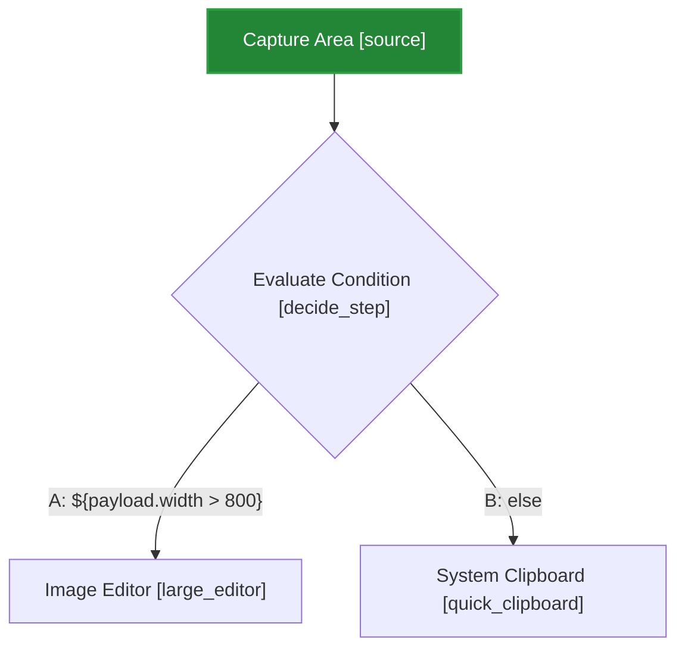

# Greenshot Capture Recipes Guide

Greenshot features a modular, recipe-driven capture pipeline powered by a **Directed Acyclic Graph (DAG)** workflow engine. Instead of linear, hardcoded sequences, screenshot workflows are defined as graphs of configurable execution nodes with support for parallel branch splitting (fork), path merging (join), variable assignment, scoped user/computer environment expressions, and rich surface drawable placement.

Recipes can be written in code or provided as external `.json` (`.gsrecipe.json`) files. External JSON recipes can create new custom capture workflows or securely override Greenshot's built-in recipes.

> [!IMPORTANT]
> **Experimental Feature Notice & Activation**:
> Capture Recipes, the DAG workflow execution engine, the Visual Recipe Editor, and external recipe loading are **experimental features** primarily intended for technical, tech-affine users and power users. We do not know yet if or in what format this capability will be made available in future public releases.
>
> ### How to Enable Capture Recipes in Greenshot:
> To enable external recipes, context menu triggers, the Recipe Importer, and the Visual Recipe Editor:
> 1. Open your `greenshot.ini` configuration file (located in `%APPDATA%\Greenshot\greenshot.ini` or in the application directory if portable).
> 2. Under the `[Core]` section, enable beta tester mode:
>    ```ini
>    [Core]
>    BetaTester=True
>    ```
> 3. Restart Greenshot.
> 4. Right-click the Greenshot system tray icon to reveal the new **Recipes** menu:
>    - **Recipes $\rightarrow$ [Configured Recipe Triggers]**: Runs recipe workflows with a single click.
>    - **Recipes $\rightarrow$ Import Recipe...**: Imports and installs `.gsrecipe.json` recipe files.
>    - **Recipes $\rightarrow$ Reload Recipes**: Hot-reloads all recipes from disk without restarting Greenshot.
>    - **Recipes $\rightarrow$ Recipe Editor...**: Opens the visual node-based Recipe Editor.
>
> Custom recipes are stored in `%APPDATA%\Greenshot\Recipes\*.gsrecipe.json`.

---

## 1. Core Architecture: Decoupling Triggers from Recipes

In Greenshot:
- **A Trigger** defines *when and how* a capture is initiated (e.g. pressing a hotkey like `PrintScreen`, clicking a systray menu item, or receiving a clipboard image).
- **A Recipe** defines *what DAG workflow of nodes* executes once triggered (e.g. acquiring pixels, showing an interactive selection rectangle, evaluating environment variables, branching to parallel feedback and watermark steps, running OCR, stamping drawables, and exporting to destinations).

Triggers and recipes are decoupled. Any trigger can run any recipe, and a single recipe can be executed by multiple triggers or invoked manually.

---

## 2. Directed Acyclic Graph (DAG) Workflow Engine

Every recipe defines:
1. **`nodes`**: A list of execution nodes, each having a unique flow-local `id`, a `stepType`, an optional `name`, and step-specific `parameters`.
2. **`flow`**: A graph configuration defining entry point(s) (`startNodes`), unconditional transitions (`transitions`), and branch-routed transitions (`conditionalTransitions`).


```
                    ┌─────────────────┐
                    │  capture_node   │
                    └────────┬────────┘
                             │
                    ┌────────▼────────┐
                    │   select_node   │
                    └────────┬────────┘
                             │ (Fork / Split)
                ┌────────────┴────────────┐
                │                         │
       ┌────────▼────────┐       ┌────────▼────────┐
       │ feedback_branch │       │  set_vars_node  │
       └────────┬────────┘       └────────┬────────┘
                │                         │
                │                ┌────────▼────────┐
                │                │  watermark_node │
                │                └────────┬────────┘
                │                         │
                └────────────┬────────────┘
                             │ (Join / Merge)
                    ┌────────▼────────┐
                    │   export_join   │
                    └─────────────────┘
```

### Fork, Join & Conditional Branch Execution Semantics
- **Parallel Branching (Fork)**: When an unconditional transition maps one node to multiple targets (e.g. `"select_node": ["feedback_branch", "set_vars_node"]`), all downstream branches execute concurrently as async tasks.
- **Barrier Synchronization (Join)**: When multiple branches converge into a single downstream node (e.g. `export_join`), the engine pauses execution of that node until **all** parent dependency branches have fully completed.
- **Conditional Decision Routing**: A `Conditional` node defines ordered decision `branches` (e.g. `[ { "key": "A", "expression": "${payload.width > 800}" }, { "key": "B", "expression": "else" } ]`). Downstream routing from branch pins is declared in `flow.conditionalTransitions` (e.g. `[ { "from": "decide", "branch": "A", "to": "full_editor" } ]`).
- **Acyclic Enforcement**: The workflow engine performs cycle detection during recipe load. If any cycle/loop is detected, the recipe is rejected with a validation error.

### Flow Definition Syntax
Transitions map source node IDs to arrays of downstream target node IDs:

```json
"flow": {
  "startNodes": [ "source" ],
  "transitions": {
    "source": [ "select" ],
    "select": [ "feedback", "watermark" ],
    "watermark": [ "export" ],
    "feedback": [ "export" ]
  }
}
```

When using conditional branching:
```json
"flow": {
  "startNodes": [ "source" ],
  "transitions": {
    "source": [ "decide_step" ]
  },
  "conditionalTransitions": [
    { "from": "decide_step", "branch": "A", "to": "large_editor" },
    { "from": "decide_step", "branch": "B", "to": "quick_clipboard" }
  ]
}
```

### Mermaid Workflow Diagram Export
Both the WPF Recipe Editor and Web Recipe Editor include a **Mermaid** export button (`🧜 Mermaid` / `Mermaid`). This generates a clean, text-based [Mermaid.js](https://mermaid.js.org/) flowchart DSL representing the recipe's nodes, decision diamonds, unconditional transitions, branch conditions, and entry points:



You can copy and paste this text directly into Markdown files, GitHub READMEs, or pull request descriptions.

---

## 3. Dynamic Expressions & Scoped Environment Variables

Recipe step parameters support embedded mathematical expressions, boolean conditions, string interpolation, and system environment information using `${...}` syntax exclusively.

### Scopes & Variable Sources
Greenshot expression evaluation separates system information into distinct scopes:

| Scope Prefix | Source | Description | Example |
|---|---|---|---|
| `user.*` | Windows User Environment | User-specific environment variables (from `EnvironmentVariableTarget.User`) | `${user.username}`, `${user.temp}`, `${user.appdata}` |
| `machine.*` | Windows Machine Environment | System-wide / machine-scoped environment variables (from `EnvironmentVariableTarget.Machine`) | `${machine.computername}`, `${machine.os}`, `${machine.programfiles}` |
| `config.*` | Greenshot INI Configuration | Live configuration settings from `greenshot.ini` | `${config.language}`, `${config.capturemousepointer}` |
| `context.*` | Pipeline Flow Context | Variables stored in `context.Properties` or set by preceding steps | `${context.watermark_text}`, `${context.WindowTitle}` |
| `payload.*` | Capture Surface Metrics | Dynamic dimensions and details of the current capture | `${payload.width}`, `${payload.height}`, `${payload.extractedtext}` |
| `now:format` | Date / Time | Current timestamp formatted with .NET DateTime format strings | `${now:yyyy-MM-dd HH:mm:ss}` |

### Mathematical & Logical Expressions
Parameters such as coordinates, widths, heights, and variables can be calculated dynamically inside `${...}`:
- `"${payload.width - 200}"`
- `"${payload.height * 0.5}"`
- `"${(payload.width / 2) - 50}"`

### Setting Variables (`SetVariable` Step)
Create or transform variables in the pipeline context for downstream nodes to consume:

```json
{
  "id": "set_metadata",
  "stepType": "SetVariable",
  "parameters": {
    "variables": {
      "captured_by": "Captured by ${user.username} on ${machine.computername}",
      "watermark_box_width": "${payload.width * 0.4}",
      "timestamp_header": "[${now:yyyy-MM-dd HH:mm:ss}]"
    }
  }
}
```

---

## 4. Surface Drawables (`Drawable` Step)

The `Drawable` step allows adding any Greenshot drawable container to the captured surface.

### Supported Drawable Types
- **Shapes & Lines**: `Rectangle`, `Ellipse`, `Line`, `Arrow`, `Freehand`
- **Text & Annotations**: `Text`, `Speechbubble`, `StepLabel`
- **Images & Icons**: `Image`, `Icon`, `Cursor`, `Emoji`, `Svg`
- **Filters & Effects**: `Obfuscate`, `Blur`, `Pixelize`, `Highlight`, `Magnify`, `Crop`

### Flexible Positioning: Absolute, Calculated & Anchored
Drawables can be positioned using:
1. **Absolute Coordinates**: Fixed integers (`left: 50, top: 100, width: 200, height: 40`).
2. **Calculated Expressions**: Dynamic formulas using `${payload.width}` and `${payload.height}` (e.g. `top: "${payload.height - 60}"`, `width: "${payload.width / 2}"`).
3. **Anchor Alignments**:
   - `horizontalAnchor`: `"Left"`, `"Center"` (or `"Middle"`), `"Right"`
   - `verticalAnchor`: `"Top"`, `"Center"` (or `"Middle"`), `"Bottom"`
   - Optional `offsetX` and `offsetY` pixel adjustments.

#### Example Drawable Node Configuration
```json
{
  "id": "stamp_watermark",
  "stepType": "Drawable",
  "parameters": {
    "drawables": [
      {
        "type": "Rectangle",
        "horizontalAnchor": "Right",
        "verticalAnchor": "Bottom",
        "width": 380,
        "height": 40,
        "offsetX": -15,
        "offsetY": -15,
        "fillColor": "rgba(0, 0, 0, 180)",
        "lineColor": "#0078D7",
        "lineThickness": 2,
        "shadow": true
      },
      {
        "type": "Text",
        "horizontalAnchor": "Right",
        "verticalAnchor": "Bottom",
        "width": 370,
        "height": 30,
        "offsetX": -20,
        "offsetY": -20,
        "text": "User: ${user.username} | Host: ${machine.computername} | ${now:yyyy-MM-dd}",
        "textColor": "#FFFFFF",
        "fontSize": 9.5,
        "bold": true
      },
      {
        "type": "Emoji",
        "horizontalAnchor": "Left",
        "verticalAnchor": "Bottom",
        "left": 20,
        "top": "${payload.height - 45}",
        "emoji": "🛡️",
        "size": 32
      }
    ]
  }
}
```

---

## 5. Configuration Precedence Explained

Greenshot resolves every parameter using a strict **three-tier precedence model**:

```
┌─────────────────────────────────────────────────────────────┐
│ Priority 1: Runtime Context Override                        │
│   (Forced for this single run by CLI, Trigger, or API)      │
├─────────────────────────────────────────────────────────────┤
│ Priority 2: Node Parameter Pre-definition                   │
│   (Explicitly defined in the recipe JSON or C# code)        │
├─────────────────────────────────────────────────────────────┤
│ Priority 3: Dynamic User Configuration Evaluation           │
│   (Omitted/null in JSON → evaluated live from greenshot.ini)│
└─────────────────────────────────────────────────────────────┘
```

1. **Priority 1 (Runtime Context Override)**: Explicit parameters supplied for this specific run in `context.Properties` (e.g. from CLI switch `--no-mouse`).
2. **Priority 2 (Node Parameter Pre-definition)**: Hardcoded parameter or expression defined on the node in the recipe JSON.
3. **Priority 3 (Dynamic Evaluation)**: Parameter omitted or `null` in JSON → dynamically evaluates live setting from `greenshot.ini` (`CoreConfig`).

---

## 6. Complete Recipe Examples

### Example 1: Region Capture with Blue Border
Interactive region capture that adds a 2px blue border and opens the editor:

```json
{
  "$schema": "./recipe.schema.json",
  "id": "recipe_region_blue_border",
  "name": "Region with Blue Border",
  "description": "Interactive region capture that adds a 2px blue border and opens the editor",
  "triggers": [
    {
      "triggerType": "ContextMenu",
      "name": "Region with Border Menu Item",
      "parameters": {
        "menuItemText": "Region with Blue Border",
        "group": "Recipes"
      }
    },
    {
      "triggerType": "Hotkey",
      "parameters": {
        "hotkey": "Ctrl + Shift + B"
      }
    }
  ],
  "nodes": [
    {
      "id": "source",
      "stepType": "Source",
      "parameters": { "sourceType": "Region" }
    },
    {
      "id": "select",
      "stepType": "InteractiveSelection",
      "parameters": { "selectionMode": "Region" }
    },
    {
      "id": "border",
      "stepType": "Effect",
      "parameters": { "effect": "Border", "width": 2, "color": "#0000FF" }
    },
    {
      "id": "feedback",
      "stepType": "ImmediateFeedback",
      "parameters": { "playSound": true }
    },
    {
      "id": "destination",
      "stepType": "Destinations",
      "parameters": { "destinationDesignations": [ "Editor" ] }
    }
  ],
  "flow": {
    "startNodes": [ "source" ],
    "transitions": {
      "source": [ "select" ],
      "select": [ "border" ],
      "border": [ "feedback" ],
      "feedback": [ "destination" ]
    }
  }
}
```

### Example 2: Branching DAG Workflow with Environment Watermark
Demonstrating parallel fork/join execution, variable evaluation, user & machine environment scopes, and drawable surface stamping:

```json
{
  "$schema": "./recipe.schema.json",
  "id": "recipe_dag_watermark_branching",
  "name": "DAG Workflow with Environment Watermark and Parallel Feedback",
  "description": "Demonstrates DAG branching, variable assignment, scoped user/machine environment variables, mathematical positioning expressions, and multi-drawable surface stamping.",
  "triggers": [
    {
      "triggerType": "Hotkey",
      "parameters": { "hotkey": "Ctrl + Shift + W" }
    }
  ],
  "nodes": [
    {
      "id": "capture_node",
      "stepType": "Source",
      "parameters": { "sourceType": "Region" }
    },
    {
      "id": "select_node",
      "stepType": "InteractiveSelection",
      "parameters": { "selectionMode": "Region", "allowWindowSnapping": true }
    },
    {
      "id": "feedback_branch",
      "stepType": "ImmediateFeedback",
      "parameters": { "playSound": true }
    },
    {
      "id": "set_vars_node",
      "stepType": "SetVariable",
      "parameters": {
        "variables": {
          "department": "Engineering QA",
          "watermark_text": "Captured by ${user.username} on ${machine.computername} [${now:yyyy-MM-dd HH:mm}]"
        }
      }
    },
    {
      "id": "watermark_node",
      "stepType": "Drawable",
      "parameters": {
        "drawables": [
          {
            "type": "Rectangle",
            "horizontalAnchor": "Right",
            "verticalAnchor": "Bottom",
            "width": 380,
            "height": 40,
            "offsetX": -15,
            "offsetY": -15,
            "fillColor": "rgba(0, 0, 0, 180)",
            "lineColor": "#0078D7",
            "lineThickness": 2,
            "shadow": true
          },
          {
            "type": "Text",
            "horizontalAnchor": "Right",
            "verticalAnchor": "Bottom",
            "width": 370,
            "height": 30,
            "offsetX": -20,
            "offsetY": -20,
            "text": "${context.watermark_text}",
            "textColor": "#FFFFFF",
            "fontSize": 9.5,
            "fontFamily": "Segoe UI",
            "bold": true
          }
        ]
      }
    },
    {
      "id": "export_join",
      "stepType": "Destinations",
      "parameters": {
        "destinationDesignations": [ "Editor", "Clipboard" ]
      }
    }
  ],
  "flow": {
    "startNodes": [ "capture_node" ],
    "transitions": {
      "capture_node": [ "select_node" ],
      "select_node": [ "feedback_branch", "set_vars_node" ],
      "set_vars_node": [ "watermark_node" ],
      "feedback_branch": [ "export_join" ],
      "watermark_node": [ "export_join" ]
    }
  }
}
```

### Example 3: Targeted Window Capture with Regex DLP Redaction
Captures a specific window, applies a drop shadow, scans OCR text for sensitive patterns, redacts them with black bounding boxes, and opens the editor:

```json
{
  "$schema": "./recipe.schema.json",
  "id": "recipe_window_regex_redact",
  "name": "Target Window with DLP Redaction",
  "description": "Captures a targeted window, adds drop shadow, runs OCR to find sensitive patterns, redacts them, and opens the editor",
  "triggers": [
    {
      "triggerType": "Hotkey",
      "parameters": { "hotkey": "Ctrl + Shift + D" }
    }
  ],
  "nodes": [
    {
      "id": "capture_window",
      "stepType": "Source",
      "parameters": {
        "sourceType": "ActiveWindow",
        "windowTitlePattern": ".*(Notepad|Editor|Greenshot|Chrome|Edge).*",
        "matchCase": false
      }
    },
    {
      "id": "shadow",
      "stepType": "Effect",
      "parameters": { "effect": "DropShadow", "shadowSize": 10, "darkness": 0.65 }
    },
    {
      "id": "redact",
      "stepType": "TextEffect",
      "parameters": {
        "effect": "Redact",
        "fillColor": "#000000",
        "scope": "Auto",
        "patterns": [
          "\\b\\d{4}[ -]?\\d{4}[ -]?\\d{4}[ -]?\\d{4}\\b",
          "[a-zA-Z0-9._%+-]+@[a-zA-Z0-9.-]+\\.[a-zA-Z]{2,}",
          "\\b(AKIA|AIza|ghp_|glpat-)[A-Za-z0-9_\\-]{16,}\\b"
        ],
        "paddingHorizontal": 12,
        "paddingVertical": 25
      }
    },
    {
      "id": "feedback",
      "stepType": "ImmediateFeedback",
      "parameters": { "playSound": true }
    },
    {
      "id": "destination",
      "stepType": "Destinations",
      "parameters": { "destinationDesignations": [ "Editor" ] }
    }
  ],
  "flow": {
    "startNodes": [ "capture_window" ],
    "transitions": {
      "capture_window": [ "shadow" ],
      "shadow": [ "redact" ],
      "redact": [ "feedback" ],
      "feedback": [ "destination" ]
    }
  }
}
```

### Example 4: Conditional Decision Routing by Screen Dimensions
Evaluates captured screenshot dimensions to route large screen captures through border decoration and image editing, while routing smaller region snips directly to the clipboard:

```json
{
  "$schema": "./recipe.schema.json",
  "id": "recipe_conditional_size_route",
  "name": "Conditional Capture Routing",
  "description": "Demonstrates Conditional decision node evaluation and branch-routed transitions",
  "triggers": [
    {
      "triggerType": "Hotkey",
      "parameters": { "hotkey": "Ctrl + Shift + C" }
    }
  ],
  "nodes": [
    {
      "id": "source",
      "stepType": "Source",
      "parameters": { "sourceType": "Region" }
    },
    {
      "id": "decide_size",
      "stepType": "Conditional",
      "parameters": {
        "branches": [
          { "key": "Large", "expression": "${payload.width > 800}" },
          { "key": "Small", "expression": "else" }
        ]
      }
    },
    {
      "id": "large_editor",
      "stepType": "Destinations",
      "parameters": { "destinationDesignations": [ "Editor" ] }
    },
    {
      "id": "quick_clipboard",
      "stepType": "Destinations",
      "parameters": { "destinationDesignations": [ "Clipboard" ] }
    }
  ],
  "flow": {
    "startNodes": [ "source" ],
    "transitions": {
      "source": [ "decide_size" ]
    },
    "conditionalTransitions": [
      { "from": "decide_size", "branch": "Large", "to": "large_editor" },
      { "from": "decide_size", "branch": "Small", "to": "quick_clipboard" }
    ]
  }
}
```

---

## 7. Extension & Plugin Step Providers

Greenshot plugins can dynamically register custom recipe step factories by implementing `IRecipeStepProvider`. Plugin step registration is completed before recipes are loaded, ensuring that all available steps are known when recipes are parsed and validated.

### Missing Extension Validation
If a recipe references a step type provided by a plugin that is **not installed or disabled**, the recipe fails validation during loading and is not made available in Greenshot. An informative error message indicates the exact missing step type and explains that the corresponding plugin/extension is required.

### Available Plugin Step Types

| Step Type | Plugin | Description | Example Parameters |
|---|---|---|---|
| `ExternalCommand`<br>`ExecuteCommand`<br>`RunCommand` | `Greenshot.Plugin.ExternalCommand` | Executes external command-line tools or configured external commands against the capture surface/file. | `commandLine`, `arguments`, `commandName`, `sync`, `timeoutMs`, `reloadAfterExecution` |
| `ExternalCommand.<Name>` | `Greenshot.Plugin.ExternalCommand` | Executes a specific pre-configured external command from `greenshot.ini`. | `sync`, `timeoutMs`, `reloadAfterExecution` |
| `Box`<br>`BoxUpload` | `Greenshot.Plugin.Box` | Uploads capture to Box cloud storage and stores the URL in context. | `format`, `jpegQuality` |
| `Dropbox`<br>`DropboxUpload` | `Greenshot.Plugin.Dropbox` | Uploads capture to Dropbox and stores the URL in context. | `format`, `jpegQuality` |
| `Imgur`<br>`ImgurUpload` | `Greenshot.Plugin.Imgur` | Uploads capture to Imgur (with title/description) and optionally copies the link to the clipboard. | `title`, `description`, `copyLinkToClipboard` |
| `Jira`<br>`JiraUpload` | `Greenshot.Plugin.Jira` | Attaches capture to a Jira issue or opens Jira issue selection. | `issueKey`, `comment`, `format`, `jpegQuality` |
| `Confluence`<br>`ConfluenceUpload` | `Greenshot.Plugin.Confluence` | Attaches capture to a Confluence page or opens page picker. | `pageId`, `format`, `jpegQuality` |
| `Office` | `Greenshot.Plugin.Office` | Exports capture to Microsoft Office applications. | `application` (`Excel`, `PowerPoint`, `Word`, `OneNote`, `Outlook`) |
| `Excel`, `PowerPoint`, `Word`, `OneNote`, `Outlook` | `Greenshot.Plugin.Office` | Direct application export shortcuts. | - |
| `Zxing`<br>`ScanBarcode`<br>`ReadQrCode` | `Greenshot.Plugin.Zxing` | Scans capture surface for barcodes/QR codes and sets `payload.extractedText`. | `copyToClipboard`, `variableName` |

### External Command Step In Depth

The `ExternalCommand` step allows screenshot automation workflows to invoke external optimization tools (e.g., `pngquant`, `optipng`, `cwebp`), scripts (`PowerShell`, `Bash`), custom webhooks, or processing binaries.

#### Configuration Parameters:
- **`commandLine`**: Path or executable to run (e.g. `pngquant.exe`, `powershell.exe`, `curl.exe`). Supports `${...}` variable expansion.
- **`arguments`**: Arguments string passed to the process. Supports `{0}` / `{1}` positional tokens or `${context.ExternalCommand.TargetFile}`, `${user.*}`, `${machine.*}`, etc.
- **`commandName`**: Name of a pre-configured command in `greenshot.ini` `[ExternalCommand]` section.
- **`sync`** *(default: `true`)*: If `true`, the workflow engine waits for the process to exit before continuing. If `false`, execution proceeds asynchronously.
- **`timeoutMs`** *(default: `30000`)*: Maximum execution time in milliseconds when running synchronously.
- **`format`** *(default: `png`)*: Image format saved to temporary disk before launching the command (`png`, `jpg`, `bmp`, etc.).
- **`jpegQuality`** *(default: `90`)*: JPEG compression quality if saving as JPEG.
- **`reloadAfterExecution`** *(default: `false`)*: When `true`, re-reads the modified image file from disk and updates the pipeline surface/payload for subsequent steps. Ideal for in-place image optimization tools.
- **`outputToClipboard`** *(default: `false`)*: Copies the standard output of the external command to the Windows clipboard.
- **`uriToClipboard`** *(default: `false`)*: Extracts any URI from stdout using regex and copies it to the Windows clipboard.
- **`setOutputVariable`**: Stores the raw standard output text in `context.Properties[key]`.
- **`setExitCodeVariable`**: Stores the process exit code integer in `context.Properties[key]`.

