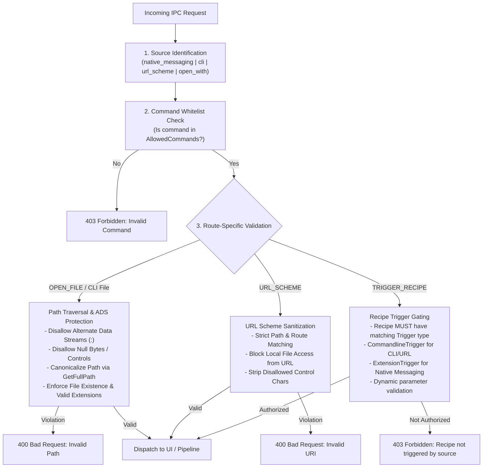

# Greenshot Native Proxy, IPC & Browser Extension Architecture

EXPERIMENTAL and not merged!

## 1. Overview & Architecture

Greenshot features a modular integration layer connecting external environments—web browsers, terminal command lines, Windows Shell handlers, and custom URL schemes—to Greenshot's core workflow and recipe engine.

At the center of this integration is **`greenshot-proxy.exe`**, a lightweight, zero-dependency native C Win32 binary that functions as a universal bridge:

```mermaid
flowchart TD
    subgraph Clients["Clients & External Callers"]
        Ext["Browser Extension<br/>(Chrome / Firefox / Edge)"]
        CLI["Terminal / Script<br/>(greenshot-proxy -r ...)"]
        URL["Custom URL Scheme<br/>(greenshot:settings, etc.)"]
        Shell["File Explorer<br/>(Open With...)"]
    end

    subgraph Proxy["greenshot-proxy.exe (Win32 Native C)"]
        direction TB
        Main["wWinMain / Console Attach"]
        Framing["Length-Prefixed JSON Framing"]
        ColdStart["Cold-Start Mutex & Process Launch"]
        PipeClient["Named Pipe Client (\\.\pipe\Greenshot_IPC)"]
        Main --> Framing
        Main --> ColdStart
        Framing --> PipeClient
    end

    subgraph GreenshotCore["Greenshot Engine (.NET Core / Framework)"]
        direction TB
        PipeServer["NamedPipeServer"]
        Security["IpcSecurityDispatcher<br/>(Strict Whitelist & Path Sanitization)"]
        Tracker["BrowserContextTracker"]
        Recipes["Recipe Engine & Triggers<br/>(Commandline, Extension, OpenFile)"]
        UI["UI Marshaler<br/>(Settings, About, Recipe Editor, Self-Service)"]
        
        PipeServer --> Security
        Security --> Tracker
        Security --> Recipes
        Security --> UI
    end

    Ext -->|Native Messaging (stdio)| Proxy
    CLI -->|Command-line Arguments| Proxy
    URL -->|Protocol Invocations| Proxy
    Shell -->|Argument Passing| Proxy
    Proxy -->|Local IPC (Named Pipe)| PipeServer
```

### Dual Binaries Architecture (`greenshot-proxy.exe` & `greenshot.com`)
Greenshot provides two native binaries compiled from the **exact same C codebase**, differing solely in their Windows PE Subsystem:

1. **`greenshot-proxy.exe` (`/SUBSYSTEM:WINDOWS`)**:
   - Used for:
     - Browser Extension Native Messaging Host (`org.greenshot.proxy.json`)
     - Custom URL Protocol Scheme (`greenshot:`) registered in Windows Registry
     - Windows Explorer Shell Handlers ("Open with...")
   - **Why GUI subsystem**: Guarantees **zero console window flash** when launched from web browsers, protocol handlers, or shell shortcuts.
2. **`greenshot.com` (`/SUBSYSTEM:CONSOLE`)**:
   - Used for:
     - Terminal invocations (`cmd.exe`, PowerShell, Bash, scripts, CI/CD)
   - **Why `.com` and Console subsystem**:
     - In Windows `cmd.exe`, the `%PATHEXT%` environment variable specifies `.COM;.EXE;.BAT;.CMD`.
     - When a user in the terminal types `greenshot -r ocr -f doc.png`, Windows automatically prioritizes and executes `greenshot.com` ahead of `greenshot.exe`!
     - Because `greenshot.com` is a Win32 PE console application, `cmd.exe` waits synchronously for execution to complete before displaying the next command prompt.
     - Full support for standard shell redirection (`>`, `2>`, `|`, `2>&1`) without timing or handle detach issues.

---

## 2. Communication Protocols & Lifecycle

### 2.1 Native Messaging & Pipe Framing
Communication across both stdio and the named pipe (`\\.\pipe\Greenshot_IPC`) uses standard 4-byte little-endian length prefix framing:

```
+-----------------------------------+---------------------------------------+
|  Length (4 bytes, Little Endian)  |  Payload (UTF-8 Encoded JSON String)  |
+-----------------------------------+---------------------------------------+
```

Every IPC request conforms to an `IpcEnvelope`:

```json
{
  "command": "TRIGGER_RECIPE",
  "source": "cli",
  "payload": {
    "recipeId": "ocr-to-stdout",
    "cwd": "C:\\Workspace",
    "params": {
      "file": "sample.png"
    }
  }
}
```

### 2.2 Cold-Start Orchestration & Concurrency
When a client invokes `greenshot-proxy.exe` while Greenshot is not running:
1. **Global Named Mutex (`Global\Greenshot_ColdStart_Mutex`)**: Prevents race conditions and multiple startup storms if multiple browser tabs or scripts call the proxy simultaneously.
2. **Cold-Start Launch**: The proxy starts `Greenshot.exe` with a 10-second readiness timeout.
3. **Pipe Polling**: The proxy polls `WaitNamedPipeW` with 250ms backoff until the server is ready, connects, and dispatches the payload.

### 2.3 URL Protocol Scheme (`greenshot:`)
Greenshot registers the `greenshot:` protocol in the Windows Registry (`HKCU\Software\Classes\greenshot`).
Both opaque (`greenshot:<action>`) and hierarchical (`greenshot://<action>`) URIs are supported:

| URI Pattern | Target UI / Action | Supported Parameters |
| :--- | :--- | :--- |
| `greenshot:settings` | WPF Settings Dialog | `?tab=general\|capture\|output\|destination\|editor\|printer\|plugins\|expert`<br>`?plugin=<PluginName>` |
| `greenshot:about` | About Dialog | — |
| `greenshot:self-service` | Diagnostics & Self-Service | `?section=debug` |
| `greenshot:recipe-editor` | Visual Recipe Editor | `?recipe=<recipe-id>` |
| `greenshot:recipe-manager` | Recipe Manager Window | — |
| `greenshot:recipe/<id>` | Executes a specific recipe | Arbitrary query parameters passed as recipe variables |

---

## 3. Security Architecture & Threat Model

Exposing an application to local named pipes, native browser messaging, and web protocol handlers introduces potential attack surfaces (e.g., malicious websites attempting protocol injection or local malicious processes attempting path traversal). Greenshot enforces defense-in-depth:



### 3.1 Strict Command Whitelist
Incoming requests are parsed in `IpcSecurityDispatcher`. Any command not explicitly declared in `AllowedCommands` is immediately rejected with a warning log:
* Allowed: `HANDSHAKE`, `TAB_CHANGED`, `EXTENSION_CAPTURE`, `TRIGGER_RECIPE`, `OPEN_FILE`, `URL_SCHEME`, `SETTINGS`, `ABOUT`, `SELF_SERVICE`, `RECIPE_EDITOR`, `RECIPE_MANAGER`.

### 3.2 Path Traversal & Alternate Data Stream (ADS) Defense
When handling file paths (e.g. `OPEN_FILE` or `-f` arguments passed to CLI recipes):
* **No Alternate Data Streams**: Any `:` character after the drive letter (e.g. `C:\file.txt:hidden_stream`) is strictly rejected.
* **No Null Bytes or Path Manipulation**: Strings containing `\0`, illegal path characters, or uncanonicalized `..` escape attempts are blocked.
* **CWD Resolution**: Relative paths passed from the CLI are resolved against the caller's working directory (`cwd`), canonicalized via `Path.GetFullPath()`, and verified to exist before being passed into the capture pipeline.
* **URL Scheme Local File Block**: Opening arbitrary local files via `greenshot:` URLs is **strictly forbidden**. Web pages cannot trigger Greenshot to open or read files on disk.

### 3.3 Recipe Trigger Gating
A recipe cannot be invoked via the proxy unless it has explicitly configured the corresponding trigger:
* To be triggered by `greenshot-proxy -r <id>` or `greenshot:recipe/<id>`, the recipe **must** include a `CommandlineTrigger`.
* To be triggered by the browser extension, the recipe **must** include an `ExtensionTrigger`.
* A recipe with only a `HotkeyTrigger` cannot be triggered from the outside world.

### 3.4 Thread Affinity & UI Marshaling
IPC requests arrive on background worker threads. Any action that displays UI (`SettingsWindow`, `AboutForm`, `SelfServiceWindow`) is marshaled onto the UI thread via `Dispatcher.BeginInvoke` or `MainForm.BeginInvoke` to avoid deadlocks and cross-thread access exceptions.

---

## 4. Recipe Integration & Possibilities

Greenshot's DAG Recipe Engine supports parameterized triggers and dynamic outputs.

### 4.1 Trigger Types

#### `CommandlineTrigger`
Enables recipes to be invoked from the CLI or a custom URL:
```json
{
  "type": "commandline",
  "command": "ocr",
  "description": "Extract text via OCR and output to stdout",
  "argumentMapping": {
    "file": "SourceFile",
    "lang": "OcrLanguage"
  }
}
```

#### `ExtensionTrigger`
Enables recipes to receive screenshots and tab metadata from the browser extension:
```json
{
  "type": "extension",
  "action": "capture-tab",
  "contextVariables": ["url", "title", "domain", "ticket"]
}
```

#### `OpenFileTrigger`
Enables recipes to handle Windows Explorer "Open With" invocations.

### 4.2 Passing Variables & Dynamic Context
External callers can supply runtime context that becomes variables inside the recipe's execution environment:

1. **Browser Metadata**: The extension injects:
   - `${Browser.Url}`: Full tab URL
   - `${Browser.Domain}`: Hostname (e.g. `github.com`)
   - `${Browser.Title}`: Document title
   - `${Browser.Ticket}`: Extracted ticket/issue ID (e.g. `JIRA-1234`)
2. **CLI Parameters**: Any `-p key=val` passed to `greenshot-proxy` is accessible as `${key}` in node expressions, file naming templates, and dynamic destination steps.

### 4.3 Outputting to Stdout or Dynamic Destinations
* **CLI Stdout Output**: A recipe with an OCR node can route text output back to the proxy, which writes it directly to the caller's console stdout.
* **Dynamic Destination Step**: In interactive environments, the dynamic destination step renders a WPF flyout menu allowing the user to route the result to the Editor, Clipboard, File, or external plugins on the fly.

---

## 5. How-To: Extending the System

### 5.1 Adding a New Custom URI Action
To add a new route (e.g., `greenshot:quick-export`):

1. **Update Command Whitelist** in [`src/Greenshot/Helpers/Ipc/IpcSecurityDispatcher.cs`](file:///d:/code/greenshot/src/Greenshot/Helpers/Ipc/IpcSecurityDispatcher.cs):
   ```csharp
   private static readonly HashSet<string> AllowedCommands = new HashSet<string>(StringComparer.OrdinalIgnoreCase)
   {
       ...
       "QUICK_EXPORT"
   };
   ```

2. **Add Parser Logic** in `ParseUrlSchemeCommand()`:
   ```csharp
   case "quick-export":
       return new IpcEnvelope
       {
           Command = "QUICK_EXPORT",
           Source = "url_scheme",
           Payload = JObject.FromObject(queryParams)
       };
   ```

3. **Implement Action Handler**:
   ```csharp
   case "QUICK_EXPORT":
       await HandleQuickExportAsync(envelope.Payload, context);
       break;
   ```
   Ensure any UI code is marshaled via `Application.Current.Dispatcher` or `MainForm.Instance.BeginInvoke`.

4. **Add Unit Test** in [`src/Greenshot.Tests/Ipc/IpcSecurityDispatcherTests.cs`](file:///d:/code/greenshot/src/Greenshot.Tests/Ipc/IpcSecurityDispatcherTests.cs):
   Add the new test URI to the `ParseUrlSchemeCommand_ValidUris_DispatchesCorrectCommand` theory.

---

### 5.2 Adding a New Feature to the Browser Extension
To add a new capability (e.g., an "Export Visible Page to PDF" button):

1. **Update UI / Popup** in [`src/Greenshot.BrowserExtension/popup/popup.html`](file:///d:/code/greenshot/src/Greenshot.BrowserExtension/popup/popup.html) & [`popup.js`](file:///d:/code/greenshot/src/Greenshot.BrowserExtension/popup/popup.js):
   Add the UI button and bind the click handler:
   ```javascript
   document.getElementById('exportPdfBtn').addEventListener('click', async () => {
       const tab = await getActiveTab();
       chrome.runtime.sendMessage({
           action: 'EXPORT_PDF',
           tabId: tab.id,
           url: tab.url,
           title: tab.title
       });
   });
   ```

2. **Handle in Background Service Worker** in [`src/Greenshot.BrowserExtension/background.js`](file:///d:/code/greenshot/src/Greenshot.BrowserExtension/background.js):
   Capture the tab or format the request and send it through the native messaging port:
   ```javascript
   if (message.action === 'EXPORT_PDF') {
       nativePort.postMessage({
           command: 'EXPORT_PDF',
           source: 'native_messaging',
           payload: {
               url: message.url,
               title: message.title
           }
       });
   }
   ```

3. **Register and Handle Command in Greenshot**:
   - Add `"EXPORT_PDF"` to `AllowedCommands` in `IpcSecurityDispatcher.cs`.
   - Add handler method `HandleExportPdfAsync(...)` in `IpcSecurityDispatcher.cs` or trigger a designated recipe with an `ExtensionTrigger`.
   - Send response envelope back through `context.ResponseStream`.
