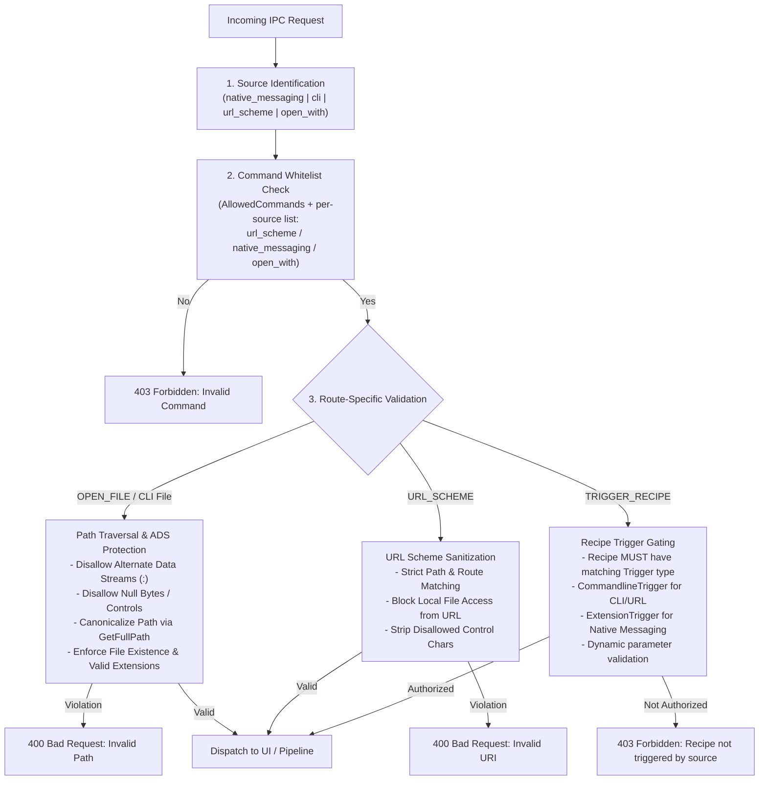

# Greenshot Native Proxy, IPC & Browser Extension Architecture

EXPERIMENTAL and not merged!

## 1. Overview & Architecture

Greenshot features a modular integration layer connecting external environments—web browsers, terminal command lines, Windows Shell handlers, and custom URL schemes—to Greenshot's core workflow and recipe engine.

At the center of this integration is **`greenshot-proxy.exe`**, a lightweight, zero-dependency native C Win32 binary that functions as a universal bridge:

```mermaid
flowchart TD
    subgraph Clients["Clients & External Callers"]
        Ext["Browser Extension<br/>(Chrome / Firefox / Edge)"]
        CLI["Terminal / Script<br/>(greenshot-proxy -r ...)"]
        URL["Custom URL Scheme<br/>(greenshot:settings, etc.)"]
        Shell["File Explorer<br/>(Open With...)"]
    end

    subgraph Proxy["greenshot-proxy.exe (Win32 Native C)"]
        direction TB
        Main["wWinMain / Console Attach"]
        Framing["Length-Prefixed JSON Framing"]
        ColdStart["Cold-Start Mutex & Process Launch"]
        PipeClient["Named Pipe Client (\\.\pipe\Greenshot_IPC)"]
        Main --> Framing
        Main --> ColdStart
        Framing --> PipeClient
    end

    subgraph GreenshotCore["Greenshot Engine (.NET Core / Framework)"]
        direction TB
        PipeServer["NamedPipeServer"]
        Security["IpcSecurityDispatcher<br/>(Strict Whitelist & Path Sanitization)"]
        Tracker["BrowserContextTracker"]
        Recipes["Recipe Engine & Triggers<br/>(Commandline, Extension, OpenFile)"]
        UI["UI Marshaler<br/>(Settings, About, Recipe Editor, Self-Service)"]
        
        PipeServer --> Security
        Security --> Tracker
        Security --> Recipes
        Security --> UI
    end

    Ext -->|Native Messaging (stdio)| Proxy
    CLI -->|Command-line Arguments| Proxy
    URL -->|Protocol Invocations| Proxy
    Shell -->|Argument Passing| Proxy
    Proxy -->|Local IPC (Named Pipe)| PipeServer
```

### Dual Binaries Architecture (`greenshot-proxy.exe` & `greenshot-cli.exe`)
Greenshot provides two small native binaries built from one C code base (`src/greenshot-proxy`). They share the
connection, framing and HELLO code and differ in their entry point (`main_cli.c`, `main_proxy.c`) and Windows PE subsystem.
Both are built **without the C runtime** (Win32 API only, about 10 KB of code each) and contain no parsing logic:
they only decide the connection source from how they were started, forward the raw arguments (or relay the browser's
messages) and print what Greenshot sends back. Parsing, validation and output formatting live in Greenshot
(`CliCommandParser`, `CliTextRenderer`), where they are unit tested.

1. **`greenshot-proxy.exe` (`/SUBSYSTEM:WINDOWS`)**:
   - Used for:
     - Browser Extension Native Messaging Host (`org.greenshot.proxy.json`)
     - Custom URL Protocol Scheme (`greenshot:`) registered in Windows Registry
     - Windows Explorer Shell Handlers ("Open with...")
   - **Why GUI subsystem**: Guarantees **zero console window flash** when launched from web browsers, protocol handlers, or shell shortcuts.
2. **`greenshot-cli.exe` (`/SUBSYSTEM:CONSOLE`)**:
   - Used for:
     - Terminal invocations (`cmd.exe`, PowerShell, Bash, scripts, CI/CD)
   - **Why a separate `.exe` with the Console subsystem**:
     - In the terminal the command is `greenshot-cli`, e.g. `greenshot-cli -r ocr -f doc.png`; `greenshot` still starts `Greenshot.exe` itself.
     - The binary used to be called `greenshot.com` so that `%PATHEXT%` (`.COM;.EXE;...`) picked it ahead of `Greenshot.exe`, but Explorer shows no icon for `.com` files. The installer removes the old `greenshot.com`.
     - Because `greenshot-cli.exe` is a Win32 PE console application, `cmd.exe` waits synchronously for execution to complete before displaying the next command prompt.
     - Full support for standard shell redirection (`>`, `2>`, `|`, `2>&1`) without timing or handle detach issues.

---

## 2. Communication Protocols & Lifecycle

### 2.1 Native Messaging & Pipe Framing
Communication across both stdio and the named pipe (`\\.\pipe\Greenshot_IPC`) uses standard 4-byte little-endian length prefix framing:

```
+-----------------------------------+---------------------------------------+
|  Length (4 bytes, Little Endian)  |  Payload (UTF-8 Encoded JSON String)  |
+-----------------------------------+---------------------------------------+
```

#### Connection handshake (`HELLO`)
The first frame on every connection is a `HELLO` written by the executable itself (or by Greenshot's own `NamedPipeClient`), before anything else is sent or relayed:

```json
{ "version": 1, "command": "HELLO", "source": "cli", "reply_format": "text", "client": "greenshot-proxy", "client_version": "1.4.0" }
```

| Started as | `source` | `reply_format` | Then sends |
| :--- | :--- | :--- | :--- |
| `greenshot-cli.exe ...` (terminal) | `cli` | `text` | `{"command":"CLI","cwd":"...","argv":[...]}` |
| `greenshot-proxy.exe greenshot:...` (URL protocol) | `url_scheme` | `text` | `{"command":"CLI","cwd":"...","argv":["greenshot:..."]}` |
| `greenshot-proxy.exe --file <path>` (Explorer) | `open_with` | `text` | `{"command":"CLI","cwd":"...","argv":["--file","<path>"]}` |
| `greenshot-proxy.exe chrome-extension://<id>/` (Chrome, Edge) | `native_messaging` (+ `origin`) | `json` | the extension's messages, relayed unchanged |
| `greenshot-proxy.exe <host-manifest>.json <extension-id>` (Firefox) | `native_messaging` (+ `origin` = extension id) | `json` | the extension's messages, relayed unchanged |

* Greenshot binds the source to the connection and **overwrites the `source` of every later envelope** with it. Data relayed from a browser can therefore never claim to be the command line.
* A connection whose first frame is not a valid `HELLO`, or that sends a second `HELLO`, receives an error frame and is closed.
* For `native_messaging` the `origin` (Chromium: `chrome-extension://<id>/`, Firefox: the extension id, both as passed by the browser) must be allowed by `ExtensionOriginPolicy`: the official extension IDs, plus the `allowed_origins` / `allowed_extensions` of the host manifests (`org.greenshot.proxy.json`, `org.greenshot.proxy-firefox.json`) next to Greenshot. The manifests are read on each connection, so a development extension ID saved by the self-service debug page works without restarting. Any other origin, or none, is rejected.

#### `CLI` requests
The raw arguments are parsed by `CliCommandParser` according to the connection source: `cli` accepts the full command line syntax, `url_scheme` exactly one `greenshot:` URL, `open_with` only file paths. The resulting command (`RUN_RECIPE`, `LIST_RECIPES`, `OPEN_FILE`, ...) is then dispatched like any other request, **including the per-source whitelist**. `--query` is only accepted from `cli` connections, because it evaluates arbitrary expressions (including environment and configuration values).

#### Replies
Handlers always produce JSON-shaped replies: streaming chunks `{"stream": "stdout" | "stderr", "text": "..."}` and one final reply `{"status": "ok" | "error", "exit_code": <int>, "stdout": "...", "stderr": "..."}`.

A client has to read its replies: a frame that is not read within 2 minutes (`NamedPipeServer.ReplyWriteTimeout`) closes the connection, so a client that only writes cannot block its handler forever.

* **`json` connections** (browser extension) receive these objects as they are.
* **`text` connections** (`greenshot-cli.exe`, `greenshot-proxy.exe`) receive *text frames*, so the executables never parse JSON. The payload's first byte is the frame type:
  * `O` + UTF-8 text: write to stdout
  * `E` + UTF-8 text: write to stderr
  * `X` + 4-byte little-endian signed exit code: end of the reply

  Every request on a text connection ends with exactly one `X` frame, also when the handler did not reply or failed.
* **`--json`** runs do not stream; the final reply is the complete result document, sent as one `O` frame:
  ```json
  { "status": "ok", "exit_code": 0, "recipe": "recipe_qr", "stdout": "...", "stderr": null,
    "payload": { "width": 800, "height": 600, "format": "Format32bppArgb", "extracted_text": null, "metadata": { } },
    "variables": { "Barcode.Text": "..." } }
  ```
  `variables` and `payload.metadata` contain only JSON-safe values (strings, numbers, booleans, dates, enums, string lists).

#### Command line (`greenshot-cli.exe`)
* `--help` and `--version` are answered by `greenshot-cli.exe` itself; everything else is forwarded to Greenshot (which is started when it is not running).
* Recipe arguments: `key=value`, `--key=value` or `--key value`. The value is taken as-is, also when it starts with `-`. `--` ends option parsing (remaining arguments must be `key=value`). Anything else is an error; nothing is silently dropped or truncated.
* Output is written as UTF-8 to pipes and files, and as UTF-16 to a console, so any Unicode (including emoji) is preserved.
* Exit codes: `0` success, `1` failure, `2` invalid command line, `3` Greenshot not available, or the exit code set by the recipe (Stderr step).

#### Command line of `Greenshot.exe`
`Greenshot.exe [startup options] [command]`

* Startup options, used only by `Greenshot.exe` itself and only at the start of the command line: `--language <code>`, `--ini-directory <dir>`, `--no-run`, `--restore` (Restart Manager) and `--help`.
* Everything after them is a command in the syntax of `greenshot-cli.exe` (e.g. `image.png`, `--file image.png`, `--recipe ocr`, `--reload`, `--exit`). `Greenshot.exe` checks it with the same parser (`CliCommandParser`) and sends it unchanged as a `CLI` request (source `cli`), exactly like `greenshot-cli.exe`. When Greenshot is not running it starts and sends the request to itself once its pipe server listens; `--exit` and `--reload` then do nothing.
* `Greenshot.exe` shows no output of the command; use `greenshot-cli.exe` for that.

### 2.2 Cold-Start Orchestration & Concurrency
When a client invokes `greenshot-proxy.exe` while Greenshot is not running:
1. **Global Named Mutex (`Global\Greenshot_ColdStart_Mutex`)**: Prevents race conditions and multiple startup storms if multiple browser tabs or scripts call the proxy simultaneously.
2. **Cold-Start Launch**: The proxy starts `Greenshot.exe` with a 10-second readiness timeout.
3. **Pipe Polling**: The proxy polls `WaitNamedPipeW` with 250ms backoff until the server is ready, connects, and dispatches the payload.

### 2.3 URL Protocol Scheme (`greenshot:`)
Greenshot registers the `greenshot:` protocol in the Windows Registry (`Software\Classes\greenshot`). Like the Native Messaging host of the browser extension, it is not released yet: the installer only registers both when `includes\browser-extension.iss` is included in `setup.iss` (the `#include` is commented out). For development, the self-service debug page registers them for the current user.
Both opaque (`greenshot:<action>`) and hierarchical (`greenshot://<action>`) URIs are supported:

| URI Pattern | Target UI / Action | Supported Parameters |
| :--- | :--- | :--- |
| `greenshot:settings` | WPF Settings Dialog | `?tab=general\|capture\|output\|destination\|editor\|printer\|plugins\|expert`<br>`?plugin=<PluginName>` |
| `greenshot:about` | About Dialog | — |
| `greenshot:self-service` | Diagnostics & Self-Service | `?section=debug` |
| `greenshot:recipe-editor` | Visual Recipe Editor | `?recipe=<recipe-id>` |
| `greenshot:recipe-manager` | Recipe Manager Window | — |
| `greenshot:recipe/<id>` | Executes a specific recipe | Arbitrary query parameters passed as recipe variables |

Any web page can open a `greenshot:` URL, so only the commands listed above are accepted from this source (e.g. `greenshot://exit` is rejected). A recipe can only be started via `greenshot:recipe/<id>` (or from the browser extension) when its Commandline trigger sets `"AllowBrowserInvocation": true`.

---

## 3. Security Architecture & Threat Model

Exposing an application to local named pipes, native browser messaging, and web protocol handlers introduces potential attack surfaces (e.g., malicious websites attempting protocol injection or local malicious processes attempting path traversal). Greenshot enforces defense-in-depth:


```mermaid
flowchart TD
    Req["Incoming IPC Request"] --> SourceCheck["1. Source Identification<br/>(native_messaging | cli | url_scheme | open_with)"]
    SourceCheck --> Whitelist["2. Command Whitelist Check<br/>(AllowedCommands + per-source list:<br/>url_scheme / native_messaging / open_with)"]
    Whitelist -- No --> RejectCommand["403 Forbidden: Invalid Command"]
    Whitelist -- Yes --> RouteCheck{"3. Route-Specific Validation"}
    
    RouteCheck -- OPEN_FILE / CLI File --> PathVal["Path Traversal & ADS Protection<br/>- Disallow Alternate Data Streams (:)<br/>- Disallow Null Bytes / Controls<br/>- Canonicalize Path via GetFullPath<br/>- Enforce File Existence & Valid Extensions"]
    PathVal -- Violation --> RejectPath["400 Bad Request: Invalid Path"]
    
    RouteCheck -- URL_SCHEME --> UrlVal["URL Scheme Sanitization<br/>- Strict Path & Route Matching<br/>- Block Local File Access from URL<br/>- Strip Disallowed Control Chars"]
    UrlVal -- Violation --> RejectUrl["400 Bad Request: Invalid URI"]
    
    RouteCheck -- TRIGGER_RECIPE --> RecipeVal["Recipe Trigger Gating<br/>- Recipe MUST have matching Trigger type<br/>- CommandlineTrigger for CLI/URL<br/>- ExtensionTrigger for Native Messaging<br/>- Dynamic parameter validation"]
    RecipeVal -- Not Authorized --> RejectRecipe["403 Forbidden: Recipe not triggered by source"]
    
    PathVal -- Valid --> Dispatch["Dispatch to UI / Pipeline"]
    UrlVal -- Valid --> Dispatch
    RecipeVal -- Authorized --> Dispatch
```

### 3.1 Strict Command Whitelist
Incoming requests are parsed in `IpcSecurityDispatcher`. Any command not explicitly declared in `AllowedCommands` is immediately rejected with a warning log:
* A command must be in the global `AllowedCommands` list **and**, for `url_scheme`, `native_messaging` and `open_with` connections, in that source's list (`SourceAllowedCommands`). `cli` connections may use every allowed command.
* The source is the one bound by the connection's `HELLO` frame (see 2.1), not a field the client can choose per message.

### 3.2 Path Traversal & Alternate Data Stream (ADS) Defense
When handling file paths (e.g. `OPEN_FILE` or `-f` arguments passed to CLI recipes):
* **No Alternate Data Streams**: Any `:` character after the drive letter (e.g. `C:\file.txt:hidden_stream`) is strictly rejected.
* **No Null Bytes or Path Manipulation**: Strings containing `\0`, illegal path characters, or uncanonicalized `..` escape attempts are blocked.
* **CWD Resolution**: Relative paths passed from the CLI are resolved against the caller's working directory (`cwd`), canonicalized via `Path.GetFullPath()`, and verified to exist before being passed into the capture pipeline.
* **URL Scheme Local File Block**: Opening arbitrary local files via `greenshot:` URLs is **strictly forbidden**. Web pages cannot trigger Greenshot to open or read files on disk.

### 3.2a Imported captures (`IMPORT_CAPTURE`)
* Only PNG and JPEG (checked by signature) are accepted, so GDI+ never parses metafiles, TIFF or icons coming from a browser.
* The dimensions are read from the image header before decoding: at most 32767 pixels per side and 100 megapixels, so a small file announcing a huge image cannot exhaust memory.
* Every request is acknowledged with `{"status":"ok","reply_to":"IMPORT_CAPTURE","exit_code":0,"width":...,"height":...}` or `{"status":"error","reply_to":"IMPORT_CAPTURE","exit_code":1,"stderr":"..."}`.

### 3.3 Recipe Trigger Gating
A recipe cannot be invoked via the proxy unless it has explicitly configured the corresponding trigger:
* To be triggered by `greenshot-proxy -r <id>` or `greenshot:recipe/<id>`, the recipe **must** include a `CommandlineTrigger`.
* To be triggered by the browser extension, the recipe **must** include an `ExtensionTrigger`.
* A recipe with only a `HotkeyTrigger` cannot be triggered from the outside world.

### 3.4 Thread Affinity & UI Marshaling
IPC requests arrive on background worker threads. Any action that displays UI (`SettingsWindow`, `AboutForm`, `SelfServiceWindow`) is marshaled onto the UI thread via `Dispatcher.BeginInvoke` or `MainForm.BeginInvoke` to avoid deadlocks and cross-thread access exceptions.

---

## 4. Recipe Integration & Possibilities

Greenshot's DAG Recipe Engine supports parameterized triggers and dynamic outputs.

### 4.1 Trigger Types

#### `CommandlineTrigger`
Enables recipes to be invoked from the CLI or a custom URL:
```json
{
  "type": "commandline",
  "command": "ocr",
  "description": "Extract text via OCR and output to stdout",
  "argumentMapping": {
    "file": "SourceFile",
    "lang": "OcrLanguage"
  }
}
```

#### `ExtensionTrigger`
Enables recipes to receive screenshots and tab metadata from the browser extension:
```json
{
  "type": "extension",
  "action": "capture-tab",
  "contextVariables": ["url", "title", "domain", "ticket"]
}
```

#### `OpenFileTrigger`
Enables recipes to handle files opened from Windows Explorer (double-click, "Open with") or with `greenshot --file`.

* `Filter`: the extensions the recipe handles, separated by `;` (e.g. `".png;.jpg"`). Without a filter the recipe handles every file.
* Every recipe whose filter matches the file runs. The built-in "Open file" recipe has no filter and opens the file in the editor.
* Only files that one of Greenshot's image loaders can read are accepted.

**How file types reach Greenshot.** The installer registers:

| Registration | Effect |
| :--- | :--- |
| `.greenshot` → ProgID `Greenshot.File` | Greenshot is the default application for its own format. |
| ProgID `Greenshot.Image`, listed in `OpenWithProgids` of `.png`, `.jpg`, `.jpeg`, `.bmp`, `.gif`, `.tif`, `.tiff`, `.webp`, `.ico`, `.svg`, `.jxr`, `.wdp`, `.emf`, `.wmf`, `.tga` | Greenshot appears in "Open with" for these types; their default application is not changed. |
| `Software\Greenshot\Capabilities` + `RegisteredApplications` | Greenshot is listed in Settings > Default apps, where the user can make it the default per type (Windows does not allow an application to set itself as default). |
| `Applications\greenshot-proxy.exe` (`FriendlyAppName`, `SupportedTypes`) | "Open with > Choose another app" shows the proxy as "Greenshot", only for the supported types. |

All of them start `greenshot-proxy.exe --file "%1"`, which passes the file to Greenshot (connection source `open_with`). The ProgIDs are not called `greenshot`: registry keys are case-insensitive, and `Software\Classes\greenshot` is the `greenshot:` URL protocol.

### 4.2 Passing Variables & Dynamic Context
External callers can supply runtime context that becomes variables inside the recipe's execution environment:

1. **Browser Metadata**: The extension injects:
   - `${Browser.Url}`: Full tab URL
   - `${Browser.Domain}`: Hostname (e.g. `github.com`)
   - `${Browser.Title}`: Document title
   - `${Browser.Ticket}`: Extracted ticket/issue ID (e.g. `JIRA-1234`)
2. **CLI Parameters**: `key=value`, `--key=value` or `--key value` passed after `greenshot-cli --recipe <cmd>` are bound by `CommandlineArgumentBinder` against the `arguments` declared on the recipe's `CommandlineTrigger`:
   - Only declared arguments are accepted; anything else (including names of built-in variables) fails with exit code 2 and the list of accepted arguments. A recipe without declared arguments accepts none.
   - Required arguments must be supplied, missing optional ones get their `defaultValue`.
   - The value is stored only under the argument's `variable` (defaults to its `name`), so `${variable}` is available in node expressions, file naming templates and destination steps.
   - The argument's `type` converts and checks the value: `Integer`, `Decimal`, `Boolean` (true/false, yes/no, on/off, 1/0), `Enum` or `allowedValues` (case-insensitive, canonical spelling is stored), and `FilePath` / `DirectoryPath`, which are validated like `-f` paths (3.2) and resolved against the caller's working directory. Other arguments stay plain strings and are never treated as paths.
   - Values are data: they are not evaluated as expressions. Each node parameter is evaluated exactly once by the engine, so `${...}` inside a supplied value is never expanded.

### 4.3 Outputting to Stdout or Dynamic Destinations
* **CLI Stdout Output**: A recipe with an OCR node can route text output back to the proxy, which writes it directly to the caller's console stdout.
* **Dynamic Destination Step**: In interactive environments, the dynamic destination step renders a WPF flyout menu allowing the user to route the result to the Editor, Clipboard, File, or external plugins on the fly.

---

## 5. How-To: Extending the System

### 5.1 Adding a New Custom URI Action
To add a new route (e.g., `greenshot:quick-export`):

1. **Update Command Whitelist** in [`src/Greenshot/Helpers/Ipc/IpcSecurityDispatcher.cs`](file:///d:/code/greenshot/src/Greenshot/Helpers/Ipc/IpcSecurityDispatcher.cs):
   ```csharp
   private static readonly HashSet<string> AllowedCommands = new HashSet<string>(StringComparer.OrdinalIgnoreCase)
   {
       ...
       "QUICK_EXPORT"
   };
   ```

2. **Add Parser Logic** in `ParseUrlSchemeCommand()`:
   ```csharp
   case "quick-export":
       return new IpcEnvelope
       {
           Command = "QUICK_EXPORT",
           Source = "url_scheme",
           Payload = JObject.FromObject(queryParams)
       };
   ```

3. **Implement Action Handler**:
   ```csharp
   case "QUICK_EXPORT":
       await HandleQuickExportAsync(envelope.Payload, context);
       break;
   ```
   Ensure any UI code is marshaled via `Application.Current.Dispatcher` or `MainForm.Instance.BeginInvoke`.

4. **Add Unit Test** in [`src/Greenshot.Tests/Ipc/IpcSecurityDispatcherTests.cs`](file:///d:/code/greenshot/src/Greenshot.Tests/Ipc/IpcSecurityDispatcherTests.cs):
   Add the new test URI to the `ParseUrlSchemeCommand_ValidUris_DispatchesCorrectCommand` theory.

---

### 5.2 Adding a New Feature to the Browser Extension
To add a new capability (e.g., an "Export Visible Page to PDF" button):

1. **Update UI / Popup** in [`src/Greenshot.BrowserExtension/popup/popup.html`](file:///d:/code/greenshot/src/Greenshot.BrowserExtension/popup/popup.html) & [`popup.js`](file:///d:/code/greenshot/src/Greenshot.BrowserExtension/popup/popup.js):
   Add the UI button and bind the click handler:
   ```javascript
   document.getElementById('exportPdfBtn').addEventListener('click', async () => {
       const tab = await getActiveTab();
       chrome.runtime.sendMessage({
           action: 'EXPORT_PDF',
           tabId: tab.id,
           url: tab.url,
           title: tab.title
       });
   });
   ```

2. **Handle in Background Service Worker** in [`src/Greenshot.BrowserExtension/background.js`](file:///d:/code/greenshot/src/Greenshot.BrowserExtension/background.js):
   Capture the tab or format the request and send it through the native messaging port:
   ```javascript
   if (message.action === 'EXPORT_PDF') {
       nativePort.postMessage({
           command: 'EXPORT_PDF',
           source: 'native_messaging',
           payload: {
               url: message.url,
               title: message.title
           }
       });
   }
   ```

3. **Register and Handle Command in Greenshot**:
   - Add `"EXPORT_PDF"` to `AllowedCommands` and to the `native_messaging` entry of `SourceAllowedCommands` in `IpcSecurityDispatcher.cs`. (The `source` field sent by the extension is ignored; the proxy's `HELLO` decides.)
   - Add handler method `HandleExportPdfAsync(...)` in `IpcSecurityDispatcher.cs` or trigger a designated recipe with an `ExtensionTrigger`.
   - Send response envelope back through `context.ResponseStream`.
