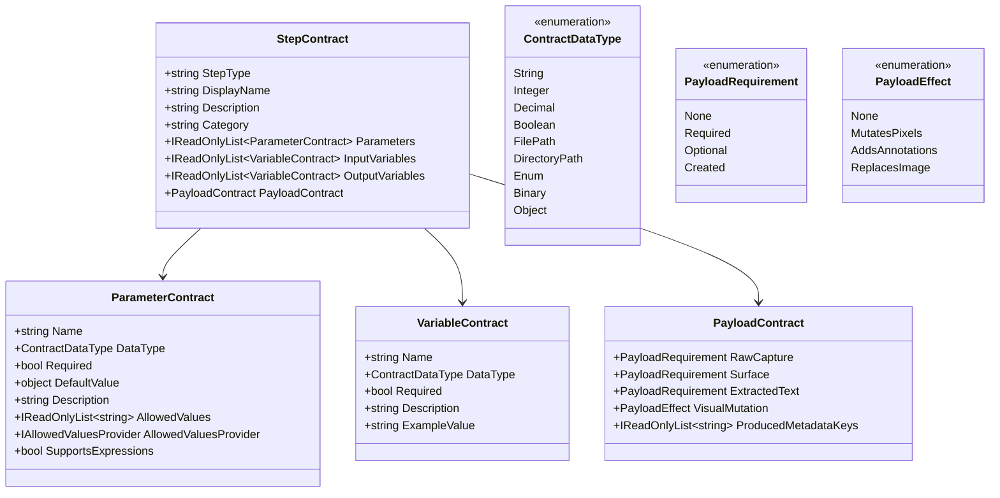
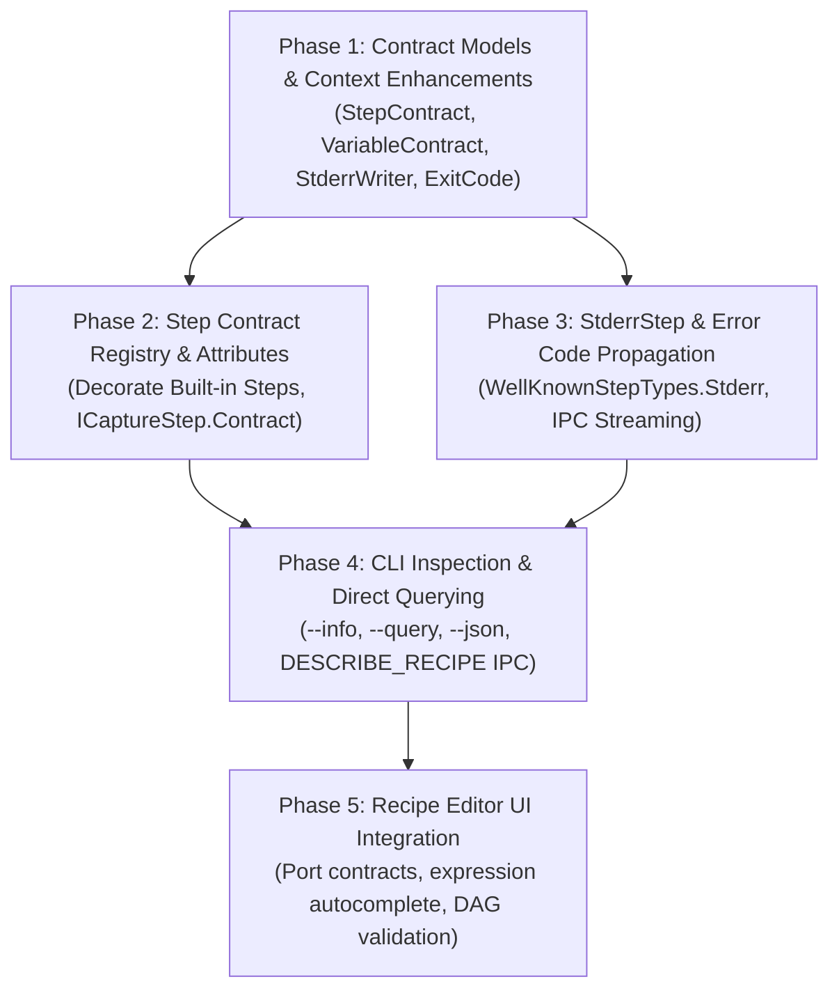

# Architectural Plan: First-Class Recipe Contracts, CLI Querying, and Stderr Error Handling

This document specifies the architectural design for introducing **formal contracts** across Greenshot's capture pipeline, step nodes, and recipes. It defines how steps and recipes disclose what they consume and produce, how the CLI can query arbitrary values directly from the payload without modifying recipes, and how `StderrStep` and custom exit codes are supported.

---

## 1. Executive Summary & Goals

### Problems Addressed
1. **Implicit Contracts & Parameter Guessing**: Currently, steps read from `context.Properties` or `nodeConfig.Parameters` with loose conventions. There is no machine-readable way to know what a step needs, what types it expects, or what variables/metadata it sets.
2. **Opaque Payload Mutations**: Changes to the capture payload (e.g. acquiring an image, drawing annotations, modifying pixels, extracting OCR text) are hidden in step execution logic. The recipe editor cannot validate whether a step requires an image before running.
3. **No Direct Output Querying**: To extract a single value (such as an image dimension or a decoded barcode), a user currently must modify or author a recipe with a `StdoutStep` or `stdout` trigger expression.
4. **No Pipeline Error Emission or Custom Exit Codes**: Recipes lack a dedicated step to signal errors, output to `stderr`, and return a custom error exit code to the CLI or calling script.

### Key Capabilities Introduced
* **Formal `StepContract` & `RecipeContract`**: Declarative schemas for every step and recipe specifying expected inputs, produced outputs, parameter types, and visual payload impact.
* **Dual Declaration Model**: Attribute-based annotations on step classes for clean compile-time definitions, plus a fluent programmatic API for dynamic or plugin-provided steps.
* **CLI Recipe Introspection (`greenshot --info <recipe>`)**: Rich human-readable or JSON disclosure of a recipe's complete contract and node topology.
* **Direct Value Querying (`greenshot-cli -r <recipe> --query "${Payload.Width}x${Payload.Height}"` or `--json`)**: Extract arbitrary context or payload values directly from the command line without editing the recipe.
* **`StderrStep` & Custom Exit Codes**: Dedicated pipeline node to stream messages to stderr in real time and abort execution with a caller-defined exit code (e.g. `2`, `404`).
* **Recipe Editor Visual Introspection**: Port contracts, variable autocomplete in `${...}` expressions, and compile-time DAG dependency validation.

---

## 2. Step Contract Architecture

### 2.1 The Contract Model

Each step will expose a `StepContract` describing four distinct dimensions:
1. **Parameters (`RecipeNodeConfig.Parameters`)**: Step configuration properties set when configuring the node.
2. **Input Variables (`CaptureFlowContext.Properties`)**: Flow variables expected to be present before the step runs.
3. **Output Variables (`CaptureFlowContext.Properties`)**: Flow variables produced or updated by the step.
4. **Payload Contract (`ICapturePayload`)**: Expectations and modifications regarding the visual capture, annotations, and metadata.



---

### 2.2 Core Enums & Data Types

```csharp
namespace Greenshot.Base.Pipeline.Contracts
{
    public enum ContractDataType
    {
        String,
        Integer,
        Decimal,
        Boolean,
        FilePath,
        DirectoryPath,
        Enum,
        Object
    }

    public enum PayloadRequirement
    {
        /// <summary>Step does not interact with this payload component.</summary>
        None,
        /// <summary>Step requires this component to exist prior to execution.</summary>
        Required,
        /// <summary>Step utilizes this component if present, but can operate without it.</summary>
        Optional,
        /// <summary>Step creates or initializes this component.</summary>
        Created
    }

    public enum PayloadEffect
    {
        /// <summary>Step does not modify the image bitmap or surface.</summary>
        None,
        /// <summary>Step modifies the pixel data of the image (e.g. crop, grayscale, border).</summary>
        MutatesPixels,
        /// <summary>Step attaches drawable annotation elements to the surface.</summary>
        AddsAnnotations,
        /// <summary>Step completely replaces the image payload.</summary>
        ReplacesImage
    }
}
```

---

### 2.3 One Registry for Step Types and Contracts

A contract describes a step *type*, not a step instance, so it is not a member of `ICaptureStep`. It is registered together with the step's factory in `IStepRegistry`, keyed by the contract's step type. Every step type has exactly one name (case-insensitive):

```csharp
public interface IStepRegistry
{
    void Register(StepContract contract, Func<RecipeNodeConfig, ICaptureStep> factory);
    StepContract GetContract(string stepType);
    IReadOnlyCollection<StepContract> Contracts { get; }
    ICaptureStep CreateStep(RecipeNodeConfig config);
    // IsRegistered, RegisteredStepTypes, RegisterProvider(s)
}

// Usual registration: the contract comes from the class' attributes
registry.Register<StdoutStep>(config => new StdoutStep(config));
// A class implementing several step types gets a contract per step type
registry.Register<DestinationExportStep>(WellKnownStepTypes.Clipboard, "Copy to Clipboard", "...", config => new DestinationExportStep(config, dispatcher));
```

Plugins register through `IRecipeStepProvider.RegisterSteps(IStepRegistry)` the same way, so their contracts are known to `--info` and the recipe analysis. Registering a step type again replaces its registration. A configured external command is chosen with the `Command` parameter of the `ExternalCommand` step.

---

### 2.4 Declarative Attributes & Contract Generation

Step classes are decorated with attributes; `StepContractBuilder.FromType` builds the contract (and records the implementing class):

```csharp
[StepInfo(ZxingStep.StepType, "Barcode Scanner (ZXing)", "Scans and decodes 1D/2D barcodes (such as QR codes).", "Analysis")]
[StepPayload(RawCapture = PayloadRequirement.Required, Surface = PayloadRequirement.Required, ExtractedText = PayloadRequirement.Created)]
[StepParameter("SetVariable", ContractDataType.String, Description = "Also store the decoded text in this variable")]
[StepOutputVariable("Barcode.Text", ContractDataType.String, "Decoded text", Conditional = true)]
[StepOutputVariable("Barcode.Format", ContractDataType.String, "Format, e.g. QR_CODE", Conditional = true)]
[StepOutputVariable("{Parameter:SetVariable}", ContractDataType.String, "The decoded text, when SetVariable is set", Conditional = true)]
public class ZxingStep : ICaptureStep { ... }
```

* **Parameters** have one name each (parameter names are case-insensitive). `[StepInfo(AcceptsUndeclaredParameters = true)]` marks a step that reads open-ended parameters (Annotation).
* **Allowed values** of an `Enum` parameter are either fixed (`AllowedValues = new[] { ... }`) or supplied at runtime by an `IAllowedValuesProvider` (`AllowedValuesProvider = typeof(SaveableFileFormatIds)`), for values that depend on what is registered. The provider is asked every time the values are read, so e.g. file formats registered by a plugin later are allowed too. All `Format` parameters use `SaveableFileFormatIds`: the ids of the formats the file format registry can currently save.
* **Outputs** are `Conditional` when the step does not always set them (only when something was found); `WhenParameter = "SaveDirectory"` marks an output that is always set when the node has that parameter.
* **Node-specific names**: `{NodeId}` (e.g. `UserChoice.{NodeId}`), `{Parameter:A}` (the variable named by parameter A), and `{ParameterKeys:X}` (every key of the dictionary parameter X, e.g. SetVariable's `Variables`).
* The contract lists what the code does, not what it could do: an output that is declared must be set, a variable that is set must be declared. The engine checks this (3.3).

---

## 3. Recipe Contract Aggregation & Static Validation

### 3.1 Composite Recipe Contract

`RecipeContract.Analyze(recipe, registry)` follows the flow as the engine executes it, not the order of the nodes in the file:

* A node runs after all its predecessors finished or were bypassed, and shares their context.
* A node with conditional transitions (Conditional, UserPrompt) follows only the transitions of the chosen branch.
* A failing node with an error transition continues there (with `LastError`, `LastErrorType`, `FailedNodeId`) instead of with its normal successors.

Every combination of branch choices and error outcomes is a scenario. For each node:

* **Guaranteed variables**: set in every scenario that runs the node, by a node that ran before it (an ancestor in the graph) or by the trigger. Conditional outputs are never guaranteed.
* **Covered variables**: as above, but including conditional outputs (the value is empty when the step found nothing).

Trigger inputs: command-line arguments (an optional argument without default is not guaranteed), `Filename` for Open with, the image, `Capture` and `Browser` for the browser extension, `EditorForm` for editor triggers. A recipe without a source node gets its image from the trigger (`TriggerRecipePreparer` adds a source).

Recipe inputs are the trigger inputs plus required step inputs that no node produces. Recipe outputs are the outputs of all nodes (marked "not always set" when conditional) plus the payload values.

### 3.2 Static Validation (when a recipe is loaded)

`RecipeValidator.Validate` adds the analysis' findings as warnings:

* A node uses `${X}` in a parameter, `X` is set by a node of the recipe, but not on every path to this node (only in some branches), or only by nodes that do not run before it.
* A node needs an image, but on some path no preceding node acquires one.
* A required parameter is missing, a literal value is not one of the allowed values, a parameter is not read by the step.
* A node is never executed; a transition or start node refers to a node that does not exist; the flow has a cycle.

`greenshot --info <recipe>` shows the same warnings.

### 3.3 Runtime Checks

* Before a step runs, the engine checks its required parameters and required input variables. A missing one fails the node with a clear message (error transitions apply).
* After a step ran, debug builds compare what it did with its contract: variables set without being declared, declared (non-conditional) outputs not set, an image that should have been created. They are logged as `[CONTRACT]` warnings; `DagExecutionEngine.ContractViolation` lets tests collect them. Release builds do not check.
* Tests make sure every registered step type has a contract implemented by the class its factory creates, every `WellKnownStepTypes` name is registered, and the built-in recipes and `docs/examples` produce no warnings.

---

## 4. `StderrStep` and Error Code Handling

### 4.1 Pipeline Context Additions

We extend [`CaptureFlowContext`](file:///d:/code/greenshot/src/Greenshot.Base/Pipeline/CaptureFlowContext.cs) to provide dedicated stderr streaming and exit code tracking:

```csharp
public class CaptureFlowContext : IDisposable
{
    // Existing:
    public Func<string, Task> StdoutWriter { get; set; }

    // New additions:
    /// <summary>
    /// Delegate to stream error text in real time over IPC or console stderr.
    /// </summary>
    public Func<string, Task> StderrWriter { get; set; }

    /// <summary>
    /// Explicit exit code for the flow (0 = success, non-zero = failure).
    /// </summary>
    public int ExitCode { get; set; } = 0;
}
```

### 4.2 `StderrStep` Specification

* **Step Type**: `WellKnownStepTypes.Stderr = "Stderr"`.
* **Parameters**:
  * `Text` (string, expression supported): Message to output.
  * `ExitCode` (int, default: `1`): The numerical exit code to return to the process environment.
  * `Abort` (bool, default: `true`): If `true`, halts the DAG immediately with `context.Abort(evaluatedMessage)`.

```csharp
[StepInfo(WellKnownStepTypes.Stderr, "Stderr Output", "Emits an error message to stderr and optionally aborts execution with an exit code.", "Diagnostics")]
[StepParameter("Text", ContractDataType.String, Required = true, Description = "Error message to output to stderr")]
[StepParameter("ExitCode", ContractDataType.Integer, Required = false, DefaultValue = 1, Description = "Numerical process exit code (default: 1)")]
[StepParameter("Abort", ContractDataType.Boolean, Required = false, DefaultValue = true, Description = "Whether to abort recipe execution immediately")]
public class StderrStep : ICaptureStep
{
    private readonly RecipeNodeConfig _config;

    public string Name => "StderrStep";
    public StepContract Contract => StepContractRegistry.GetContract(WellKnownStepTypes.Stderr);

    public StderrStep(RecipeNodeConfig config) => _config = config;

    public async Task ExecuteAsync(CaptureFlowContext context, CancellationToken cancellationToken = default)
    {
        string rawText = _config.GetParameter<string>("Text");
        string evaluated = ExpressionEvaluator.Instance.Evaluate(rawText, context)?.ToString() ?? string.Empty;
        int exitCode = _config.GetParameter<int>("ExitCode", 1);
        bool abort = _config.GetParameter<bool>("Abort", true);

        context.ExitCode = exitCode;

        if (context.StderrWriter != null && !string.IsNullOrEmpty(evaluated))
        {
            await context.StderrWriter(evaluated).ConfigureAwait(false);
        }

        if (abort)
        {
            context.Abort(string.IsNullOrEmpty(evaluated) ? $"Aborted by StderrStep with exit code {exitCode}" : evaluated);
        }
    }
}
```

### 4.3 Streaming Protocol Frame for Stderr

When `StderrStep` writes:
```json
{
  "stream": "stderr",
  "text": "Error: Barcode not detected in file 'sample.png'\n"
}
```
`greenshot-cli.exe` immediately writes this chunk to standard error. Upon recipe completion, the process terminates with the specified `exitCode`.

---

## 5. Direct CLI Value Querying & Inspection

### 5.1 Querying Payload / Context Directly (`--query`)

Users often need a specific value from a recipe without modifying its nodes to insert a `StdoutStep`. We introduce `--query "<expression>"` to `greenshot-cli.exe`:

```bash
# Extract image dimensions:
greenshot-cli.exe -r capture_screen --query "${Payload.Width}x${Payload.Height}"
# Output: 1920x1080

# Extract QR code text:
greenshot-cli.exe -r qr --file invoice.png --query "${Barcode.Text}"
# Output: https://invoice.example.com/pay/12345

# Query saved destination file path:
greenshot-cli.exe -r save_window --query "${Destination.Filename}"
# Output: C:\Users\robin\Pictures\Greenshot\Greenshot_2026-09-27.png
```

### 5.2 JSON Output (`--json`)

If `--json` is supplied, Greenshot outputs a structured JSON object containing all execution metadata, resolved variables, and payload details:

```bash
greenshot-cli.exe -r qr --file invoice.png --json
```

Output:
```json
{
  "status": "ok",
  "exit_code": 0,
  "recipe": "qr",
  "payload": {
    "width": 800,
    "height": 600,
    "format": "Format32bppArgb",
    "extracted_text": null,
    "metadata": {
      "filename": "invoice.png",
      "source": "file"
    }
  },
  "variables": {
    "Filename": "D:\\docs\\invoice.png",
    "Barcode.Text": "https://invoice.example.com/pay/12345",
    "Barcode.Format": "QR_CODE"
  }
}
```

---

### 5.3 CLI Recipe Introspection (`--info`)

Users can inspect any recipe's full contract directly from the terminal:

```bash
greenshot-cli.exe --info qr
```

Sample output:
```text
Recipe: qr (Scan and decode QR code)
Category: Analysis
Description: Reads an image file and decodes any 1D/2D barcodes present.

Triggers:
  Commandline: qr
    Arguments:
      --file <Filename> [required] : Path to the image file to scan
      --format <Format> [optional, default: AUTO] : Format hint (QR_CODE, etc.)

Recipe Contract:
  Inputs:
    Filename             (FilePath, Required)    : Path to image file to scan
    Format               (String, Optional)      : Barcode format hint
  Outputs:
    Barcode.Text         (String)                : Decoded text content
    Barcode.Format       (String)                : Barcode format identifier
    Payload.Width        (Integer)               : Image width in pixels
    Payload.Height       (Integer)               : Image height in pixels
  Payload Lifecycle:
    Acquires: Yes (File)
    Mutates Pixels: No
    Extracted Text: No

Step Pipeline:
  [1] source_file        (Source)          Takes: Filename -> Produces: RawCapture
  [2] scan_barcode       (BarcodeScan)     Takes: RawCapture -> Produces: Barcode.Text, Barcode.Format
  [3] output_result      (Stdout)          Takes: Barcode.Text -> Emits to stdout
```

Or in JSON format for automated tooling or extensions:
```bash
greenshot-cli.exe --info qr --json
```

---

## 6. Recipe Editor Visual Integration

With explicit step contracts, the **Recipe Editor** can offer enhanced design-time feedback:

1. **Typed Ports & Tooltips**:
   * Instead of a generic `In` and `Out` port, ports can be tagged with the payload status (`Image In`, `Image Out`) or variable names.
   * Hovering over a step node displays an interactive card detailing required parameters, expected variables, and output variables.
2. **Expression Autocomplete**:
   * When typing `${` in any parameter input field, an autocomplete dropdown shows all variables guaranteed to be available from upstream nodes in the DAG.
3. **Graph Diagnostics**:
   * Nodes missing required inputs or prerequisite payload types are outlined in red with a badge indicating the unsatisfied dependency (e.g. `Requires RawCapture from an upstream Source node`).

---

## 7. Implementation Plan



### Phase 1: Contract Models & Context Enhancements
* Create `Greenshot.Base.Pipeline.Contracts`:
  * `StepContract`, `ParameterContract`, `VariableContract`, `PayloadContract`.
  * Enums: `ContractDataType`, `PayloadRequirement`, `PayloadEffect`.
* Update `CaptureFlowContext`:
  * Add `Func<string, Task> StderrWriter`.
  * Add `int ExitCode { get; set; }`.

### Phase 2: Step Contract Registration & Attributes
* Add attributes: `[StepInfo]`, `[StepParameter]`, `[StepInputVariable]`, `[StepOutputVariable]`, `[StepPayload]`.
* Register factory and contract together in `IStepRegistry` (2.3); the contract is not part of `ICaptureStep`.
* Decorate all core and plugin steps, with the parameters and variables they actually use.

### Phase 3: `StderrStep` Implementation
* Implement `StderrStep` in `src/Greenshot/Pipeline/Steps/StderrStep.cs`.
* Register under `WellKnownStepTypes.Stderr` in `CapturePipeline`.
* Wire `context.StderrWriter` in `IpcSecurityDispatcher` to emit `{"stream": "stderr", "text": "..."}` frames.
* Propagate `context.ExitCode` into final IPC reply `exit_code`.

### Phase 4: CLI Inspection & Value Querying
* Implement IPC command `DESCRIBE_RECIPE` in `IpcSecurityDispatcher`.
* Update `cli_launcher.c` / `greenshot-cli.exe`:
  * Add `--info <recipe>` / `-i <recipe>`.
  * Add `--query "<expression>"`.
  * Add `--json` flag to dump payload and variables.
* Wire `--query` evaluation in `IpcSecurityDispatcher` so that if `--query` is provided in the IPC envelope, the evaluated string is returned as `stdout`.

### Phase 5: Recipe Editor UI Integration
* Surface contract metadata in `StepNodeViewModel`:
  * Display parameter types, descriptions, and required indicators in property sheets.
  * Populate expression autocompletion with available upstream variables.
  * Implement DAG static validation highlighting missing inputs or payload prerequisites.

---

## 8. Open Decisions & Feedback Requests

1. **`--query` fallback behavior**: If `--query "${...}"` is supplied on the CLI and the recipe *also* contains a `StdoutStep`, should `--query` override the `StdoutStep` output, or should both outputs be emitted sequentially? *(Recommendation: `--query` replaces recipe stdout, returning solely the queried expression to standard output for clean scripting integration).*
2. **Strictness of Step Contract Enforcement at Runtime**: *Decided:* the engine validates required parameters and required input variables before a step runs and fails the node with a clear message; the recipe is also checked statically when it is loaded (see 3.2 and 3.3).
3. **Naming for Stderr Step**: *Decided:* `Stderr` is the only name.
