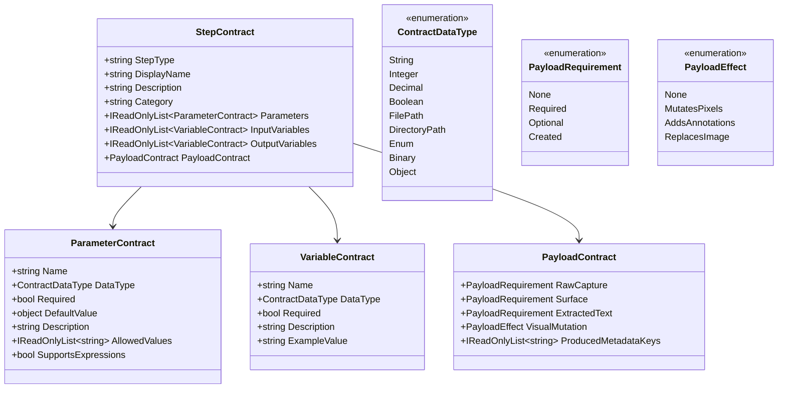
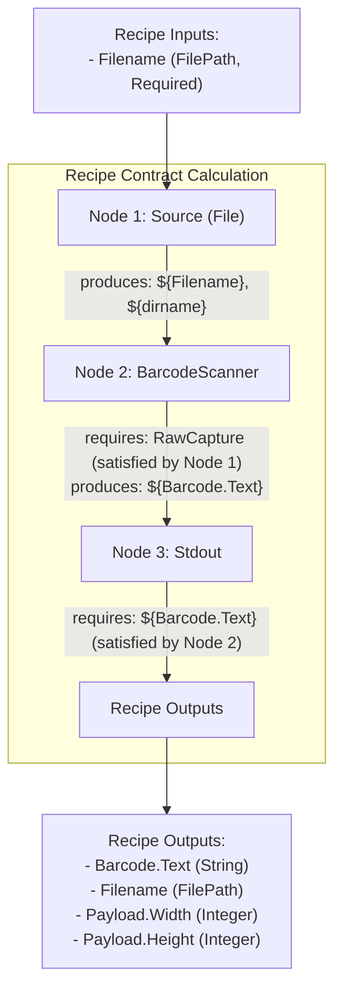
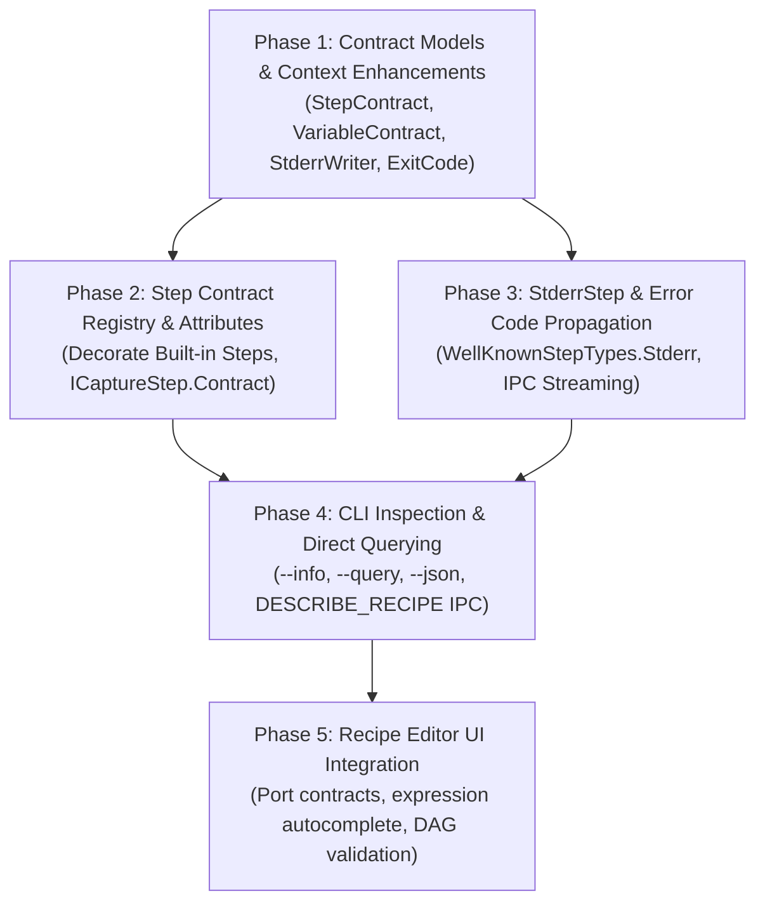

# Architectural Plan: First-Class Recipe Contracts, CLI Querying, and Stderr Error Handling

This document specifies the architectural design for introducing **formal contracts** across Greenshot's capture pipeline, step nodes, and recipes. It defines how steps and recipes disclose what they consume and produce, how the CLI can query arbitrary values directly from the payload without modifying recipes, and how `StderrStep` and custom exit codes are supported.

---

## 1. Executive Summary & Goals

### Problems Addressed
1. **Implicit Contracts & Parameter Guessing**: Currently, steps read from `context.Properties` or `nodeConfig.Parameters` with loose conventions. There is no machine-readable way to know what a step needs, what types it expects, or what variables/metadata it sets.
2. **Opaque Payload Mutations**: Changes to the capture payload (e.g. acquiring an image, drawing annotations, modifying pixels, extracting OCR text) are hidden in step execution logic. The recipe editor cannot validate whether a step requires an image before running.
3. **No Direct Output Querying**: To extract a single value (such as an image dimension or a decoded barcode), a user currently must modify or author a recipe with a `StdoutStep` or `stdout` trigger expression.
4. **No Pipeline Error Emission or Custom Exit Codes**: Recipes lack a dedicated step to signal errors, output to `stderr`, and return a custom error exit code to the CLI or calling script.

### Key Capabilities Introduced
* **Formal `StepContract` & `RecipeContract`**: Declarative schemas for every step and recipe specifying expected inputs, produced outputs, parameter types, and visual payload impact.
* **Dual Declaration Model**: Attribute-based annotations on step classes for clean compile-time definitions, plus a fluent programmatic API for dynamic or plugin-provided steps.
* **CLI Recipe Introspection (`greenshot --info <recipe>` / `--describe`)**: Rich human-readable or JSON disclosure of a recipe's complete contract and node topology.
* **Direct Value Querying (`greenshot -r <recipe> --query "${Payload.Width}x${Payload.Height}"` or `--json`)**: Extract arbitrary context or payload values directly from the command line without editing the recipe.
* **`StderrStep` & Custom Exit Codes**: Dedicated pipeline node to stream messages to stderr in real time and abort execution with a caller-defined exit code (e.g. `2`, `404`).
* **Recipe Editor Visual Introspection**: Port contracts, variable autocomplete in `${...}` expressions, and compile-time DAG dependency validation.

---

## 2. Step Contract Architecture

### 2.1 The Contract Model

Each step will expose a `StepContract` describing four distinct dimensions:
1. **Parameters (`RecipeNodeConfig.Parameters`)**: Step configuration properties set when configuring the node.
2. **Input Variables (`CaptureFlowContext.Properties`)**: Flow variables expected to be present before the step runs.
3. **Output Variables (`CaptureFlowContext.Properties`)**: Flow variables produced or updated by the step.
4. **Payload Contract (`ICapturePayload`)**: Expectations and modifications regarding the visual capture, annotations, and metadata.



---

### 2.2 Core Enums & Data Types

```csharp
namespace Greenshot.Base.Pipeline.Contracts
{
    public enum ContractDataType
    {
        String,
        Integer,
        Decimal,
        Boolean,
        FilePath,
        DirectoryPath,
        Enum,
        Object
    }

    public enum PayloadRequirement
    {
        /// <summary>Step does not interact with this payload component.</summary>
        None,
        /// <summary>Step requires this component to exist prior to execution.</summary>
        Required,
        /// <summary>Step utilizes this component if present, but can operate without it.</summary>
        Optional,
        /// <summary>Step creates or initializes this component.</summary>
        Created
    }

    public enum PayloadEffect
    {
        /// <summary>Step does not modify the image bitmap or surface.</summary>
        None,
        /// <summary>Step modifies the pixel data of the image (e.g. crop, grayscale, border).</summary>
        MutatesPixels,
        /// <summary>Step attaches drawable annotation elements to the surface.</summary>
        AddsAnnotations,
        /// <summary>Step completely replaces the image payload.</summary>
        ReplacesImage
    }
}
```

---

### 2.3 `ICaptureStep` Interface Evolution

Because backward compatibility is not constrained, `ICaptureStep` directly exposes its contract:

```csharp
namespace Greenshot.Base.Pipeline
{
    public interface ICaptureStep
    {
        /// <summary>
        /// Display name or identifier of this step.
        /// </summary>
        string Name { get; }

        /// <summary>
        /// Formal contract specifying inputs, outputs, parameters, and payload behavior.
        /// </summary>
        StepContract Contract { get; }

        /// <summary>
        /// Executes the step against the flow context.
        /// </summary>
        Task ExecuteAsync(CaptureFlowContext context, CancellationToken cancellationToken = default);
    }
}
```

---

### 2.4 Declarative Attributes & Contract Generation

Developers can decorate step classes with expressive attributes. Reflection automatically builds the `StepContract`:

```csharp
[StepInfo(WellKnownStepTypes.Source, "Acquire Source", "Acquires a capture from screen, file, or clipboard.", "Acquisition")]
[StepPayload(RawCapture = PayloadRequirement.Created, Surface = PayloadRequirement.Created)]
[StepParameter("sourceType", ContractDataType.Enum, Required = true, Description = "Type of capture source", 
    AllowedValues = new[] { "Screen", "File", "Clipboard", "ActiveWindow" })]
[StepParameter("filename", ContractDataType.FilePath, Required = false, Description = "Target file path when sourceType is File")]
[StepOutputVariable("Filename", ContractDataType.FilePath, "Full path of the acquired file (if sourceType is File)")]
[StepOutputVariable("dirname", ContractDataType.DirectoryPath, "Directory of the acquired file")]
[StepOutputVariable("basename", ContractDataType.String, "Base file name without extension")]
[StepOutputVariable("extension", ContractDataType.String, "File extension (e.g. .png)")]
public class SourceAcquisitionStep : ICaptureStep
{
    // Implementation
}
```

Example for a Barcode / QR scanner step:

```csharp
[StepInfo("BarcodeScanner", "Barcode Scanner", "Scans and decodes 1D/2D barcodes (such as QR codes) from the capture bitmap.", "Analysis")]
[StepPayload(RawCapture = PayloadRequirement.Required)]
[StepParameter("format", ContractDataType.String, Required = false, DefaultValue = "AUTO", Description = "Barcode format hint (QR_CODE, DATA_MATRIX, etc.)")]
[StepOutputVariable("Barcode.Text", ContractDataType.String, "Decoded text content of the detected barcode")]
[StepOutputVariable("Barcode.Format", ContractDataType.String, "Format name of the detected barcode")]
public class BarcodeScannerStep : ICaptureStep
{
    // Implementation
}
```

Example for a format conversion destination step:

```csharp
[StepInfo(WellKnownStepTypes.SaveFile, "Save to File", "Encodes and saves the image to a file on disk.", "Destination")]
[StepPayload(RawCapture = PayloadRequirement.Required)]
[StepParameter("path", ContractDataType.FilePath, Required = false, Description = "Target destination path or pattern")]
[StepParameter("format", ContractDataType.Enum, Required = false, DefaultValue = "png", AllowedValues = new[] { "png", "jpg", "bmp", "tiff", "greenshot" })]
[StepOutputVariable("Destination.Filename", ContractDataType.FilePath, "The final absolute path of the saved file")]
public class SaveFileStep : ICaptureStep
{
    // Implementation
}
```

---

## 3. Recipe Contract Aggregation & Static Validation

### 3.1 Composite Recipe Contract

A recipe is a directed acyclic graph (DAG) of nodes. By traversing the DAG, Greenshot computes a **`RecipeContract`**:

1. **Required Recipe Inputs**:
   - Variables required by any node that are **not** produced by any preceding node in the DAG.
   - Command-line arguments explicitly declared on the recipe's `CommandlineTrigger`.
2. **Produced Recipe Outputs**:
   - Union of all variables produced by all reachable nodes in the recipe.
   - Standard payload attributes available at the conclusion of the pipeline (e.g. `${Payload.Width}`, `${Payload.Height}`, `${Payload.ExtractedText}`).
3. **Payload Prerequisites**:
   - Whether the recipe requires an external image input or acquires one internally.



### 3.2 Static DAG Validation (Design-Time & Pre-Flight)

When a recipe is opened in the **Recipe Editor** or loaded by the pipeline, a `RecipeContractValidator` executes:
* **Missing Variable Warning**: Node B requires `${CustomVar}`, but no ancestor node sets it and no trigger provides it.
* **Payload Prerequisite Violation**: Node C (e.g. `Effect` or `Crop`) requires `RawCapture = Required`, but no ancestor node initializes `RawCapture` (e.g. missing `Source` node).
* **Dead Outputs**: Variables created but never consumed or exported.

---

## 4. `StderrStep` and Error Code Handling

### 4.1 Pipeline Context Additions

We extend [`CaptureFlowContext`](file:///d:/code/greenshot/src/Greenshot.Base/Pipeline/CaptureFlowContext.cs) to provide dedicated stderr streaming and exit code tracking:

```csharp
public class CaptureFlowContext : IDisposable
{
    // Existing:
    public Func<string, Task> StdoutWriter { get; set; }

    // New additions:
    /// <summary>
    /// Delegate to stream error text in real time over IPC or console stderr.
    /// </summary>
    public Func<string, Task> StderrWriter { get; set; }

    /// <summary>
    /// Explicit exit code for the flow (0 = success, non-zero = failure).
    /// </summary>
    public int ExitCode { get; set; } = 0;
}
```

### 4.2 `StderrStep` Specification

* **Step Type**: `WellKnownStepTypes.Stderr = "Stderr"` (aliases: `"Error"`, `"Fail"`).
* **Parameters**:
  * `text` / `message` (string, expression supported): Message to output.
  * `exitCode` (int, default: `1`): The numerical exit code to return to the process environment.
  * `abort` (bool, default: `true`): If `true`, halts the DAG immediately with `context.Abort(evaluatedMessage)`.

```csharp
[StepInfo(WellKnownStepTypes.Stderr, "Stderr Output", "Emits an error message to stderr and optionally aborts execution with an exit code.", "Diagnostics")]
[StepParameter("text", ContractDataType.String, Required = true, Description = "Error message to output to stderr")]
[StepParameter("exitCode", ContractDataType.Integer, Required = false, DefaultValue = 1, Description = "Numerical process exit code (default: 1)")]
[StepParameter("abort", ContractDataType.Boolean, Required = false, DefaultValue = true, Description = "Whether to abort recipe execution immediately")]
public class StderrStep : ICaptureStep
{
    private readonly RecipeNodeConfig _config;

    public string Name => "StderrStep";
    public StepContract Contract => StepContractRegistry.GetContract(WellKnownStepTypes.Stderr);

    public StderrStep(RecipeNodeConfig config) => _config = config;

    public async Task ExecuteAsync(CaptureFlowContext context, CancellationToken cancellationToken = default)
    {
        string rawText = _config.GetParameter<string>("text") ?? _config.GetParameter<string>("message");
        string evaluated = ExpressionEvaluator.Instance.Evaluate(rawText, context)?.ToString() ?? string.Empty;
        int exitCode = _config.GetParameter<int>("exitCode", 1);
        bool abort = _config.GetParameter<bool>("abort", true);

        context.ExitCode = exitCode;

        if (context.StderrWriter != null && !string.IsNullOrEmpty(evaluated))
        {
            await context.StderrWriter(evaluated).ConfigureAwait(false);
        }

        if (abort)
        {
            context.Abort(string.IsNullOrEmpty(evaluated) ? $"Aborted by StderrStep with exit code {exitCode}" : evaluated);
        }
    }
}
```

### 4.3 Streaming Protocol Frame for Stderr

When `StderrStep` writes:
```json
{
  "stream": "stderr",
  "text": "Error: Barcode not detected in file 'sample.png'\n"
}
```
`greenshot.com` immediately writes this chunk to standard error. Upon recipe completion, the process terminates with the specified `exitCode`.

---

## 5. Direct CLI Value Querying & Inspection

### 5.1 Querying Payload / Context Directly (`--query`)

Users often need a specific value from a recipe without modifying its nodes to insert a `StdoutStep`. We introduce `--query "<expression>"` to `greenshot.com`:

```bash
# Extract image dimensions:
greenshot.com -r capture_screen --query "${Payload.Width}x${Payload.Height}"
# Output: 1920x1080

# Extract QR code text:
greenshot.com -r qr --file invoice.png --query "${Barcode.Text}"
# Output: https://invoice.example.com/pay/12345

# Query saved destination file path:
greenshot.com -r save_window --query "${Destination.Filename}"
# Output: C:\Users\robin\Pictures\Greenshot\Greenshot_2026-09-27.png
```

### 5.2 JSON Output (`--json`)

If `--json` is supplied, Greenshot outputs a structured JSON object containing all execution metadata, resolved variables, and payload details:

```bash
greenshot.com -r qr --file invoice.png --json
```

Output:
```json
{
  "status": "ok",
  "exit_code": 0,
  "recipe": "qr",
  "payload": {
    "width": 800,
    "height": 600,
    "format": "Format32bppArgb",
    "extracted_text": null,
    "metadata": {
      "filename": "invoice.png",
      "source": "file"
    }
  },
  "variables": {
    "Filename": "D:\\docs\\invoice.png",
    "Barcode.Text": "https://invoice.example.com/pay/12345",
    "Barcode.Format": "QR_CODE"
  }
}
```

---

### 5.3 CLI Recipe Introspection (`--info` / `--describe`)

Users can inspect any recipe's full contract directly from the terminal:

```bash
greenshot.com --info qr
```

Sample output:
```text
Recipe: qr (Scan and decode QR code)
Category: Analysis
Description: Reads an image file and decodes any 1D/2D barcodes present.

Triggers:
  Commandline: qr
    Arguments:
      --file <Filename> [required] : Path to the image file to scan
      --format <Format> [optional, default: AUTO] : Format hint (QR_CODE, etc.)

Recipe Contract:
  Inputs:
    Filename             (FilePath, Required)    : Path to image file to scan
    Format               (String, Optional)      : Barcode format hint
  Outputs:
    Barcode.Text         (String)                : Decoded text content
    Barcode.Format       (String)                : Barcode format identifier
    Payload.Width        (Integer)               : Image width in pixels
    Payload.Height       (Integer)               : Image height in pixels
  Payload Lifecycle:
    Acquires: Yes (File)
    Mutates Pixels: No
    Extracted Text: No

Step Pipeline:
  [1] source_file        (Source)          Takes: Filename -> Produces: RawCapture
  [2] scan_barcode       (BarcodeScanner)  Takes: RawCapture -> Produces: Barcode.Text, Barcode.Format
  [3] output_result      (Stdout)          Takes: Barcode.Text -> Emits to stdout
```

Or in JSON format for automated tooling or extensions:
```bash
greenshot.com --info qr --json
```

---

## 6. Recipe Editor Visual Integration

With explicit step contracts, the **Recipe Editor** can offer enhanced design-time feedback:

1. **Typed Ports & Tooltips**:
   * Instead of a generic `In` and `Out` port, ports can be tagged with the payload status (`Image In`, `Image Out`) or variable names.
   * Hovering over a step node displays an interactive card detailing required parameters, expected variables, and output variables.
2. **Expression Autocomplete**:
   * When typing `${` in any parameter input field, an autocomplete dropdown shows all variables guaranteed to be available from upstream nodes in the DAG.
3. **Graph Diagnostics**:
   * Nodes missing required inputs or prerequisite payload types are outlined in red with a badge indicating the unsatisfied dependency (e.g. `Requires RawCapture from an upstream Source node`).

---

## 7. Implementation Plan



### Phase 1: Contract Models & Context Enhancements
* Create `Greenshot.Base.Pipeline.Contracts`:
  * `StepContract`, `ParameterContract`, `VariableContract`, `PayloadContract`.
  * Enums: `ContractDataType`, `PayloadRequirement`, `PayloadEffect`.
* Update `CaptureFlowContext`:
  * Add `Func<string, Task> StderrWriter`.
  * Add `int ExitCode { get; set; }`.

### Phase 2: Step Contract Registration & Attributes
* Add attributes: `[StepInfo]`, `[StepParameter]`, `[StepInputVariable]`, `[StepOutputVariable]`, `[StepPayload]`.
* Update `ICaptureStep` with `StepContract Contract { get; }`.
* Create `StepContractRegistry` to discover and index contracts across built-in steps and `IRecipeStepProvider` implementations.
* Decorate core steps: `SourceAcquisitionStep`, `DestinationExportStep`, `StdoutStep`, `EffectCaptureStep`, `AnnotationStep`, `SetVariableStep`.

### Phase 3: `StderrStep` Implementation
* Implement `StderrStep` in `src/Greenshot/Pipeline/Steps/StderrStep.cs`.
* Register under `WellKnownStepTypes.Stderr` in `CapturePipeline`.
* Wire `context.StderrWriter` in `IpcSecurityDispatcher` to emit `{"stream": "stderr", "text": "..."}` frames.
* Propagate `context.ExitCode` into final IPC reply `exit_code`.

### Phase 4: CLI Inspection & Value Querying
* Implement IPC command `DESCRIBE_RECIPE` in `IpcSecurityDispatcher`.
* Update `cli_launcher.c` / `greenshot.com`:
  * Add `--info <recipe>` / `-i <recipe>` / `--describe <recipe>`.
  * Add `--query "<expression>"`.
  * Add `--json` flag to dump payload and variables.
* Wire `--query` evaluation in `IpcSecurityDispatcher` so that if `--query` is provided in the IPC envelope, the evaluated string is returned as `stdout`.

### Phase 5: Recipe Editor UI Integration
* Surface contract metadata in `StepNodeViewModel`:
  * Display parameter types, descriptions, and required indicators in property sheets.
  * Populate expression autocompletion with available upstream variables.
  * Implement DAG static validation highlighting missing inputs or payload prerequisites.

---

## 8. Open Decisions & Feedback Requests

1. **`--query` fallback behavior**: If `--query "${...}"` is supplied on the CLI and the recipe *also* contains a `StdoutStep`, should `--query` override the `StdoutStep` output, or should both outputs be emitted sequentially? *(Recommendation: `--query` replaces recipe stdout, returning solely the queried expression to standard output for clean scripting integration).*
2. **Strictness of Step Contract Enforcement at Runtime**: Should missing `Required` input variables abort the flow automatically before step execution, or should the step handle it with custom logic? *(Recommendation: Automatic validation in `DagExecutionEngine` before step invocation with a clean error message: `Step '{stepId}' missing required variable '{varName}'`).*
3. **Naming for Stderr Step**: Which type name is preferred: `Stderr`, `Error`, or `Fail`? *(Recommendation: Register `Stderr` as canonical, with `Error` and `Fail` as aliases).*
